# 🏁 MASTER PLAN — Thai Go Tournament Manager

> **เอกสารนี้คือ Single Source of Truth ฉบับสมบูรณ์**
> ทุกอย่างอยู่ในไฟล์นี้ไฟล์เดียว — ไม่มีการชี้ไปที่ไฟล์อื่น
>
> 📅 สร้างเมื่อ: 30 พ.ค. 2569

---

## 📋 Table of Contents

1. [Product Vision](#1-product-vision)
2. [Architecture](#2-architecture)
3. [Phase Map](#3-phase-map)
4. [Decisions Locked](#4-decisions-locked)
5. [Database Schema](#5-database-schema)
6. [Domain Rules & Business Logic](#6-domain-rules--business-logic)
7. [Design System](#7-design-system)
8. [Application Flows — Phase 1](#8-application-flows--phase-1)
9. [Tournament Day Flows — Phase 2](#9-tournament-day-flows--phase-2)
10. [State Machines](#10-state-machines)
11. [Pages & UI Specs](#11-pages--ui-specs)
12. [Sitemap](#12-sitemap)
13. [Acceptance Criteria](#13-acceptance-criteria)
14. [Definition of Done](#14-definition-of-done)
15. [Sprint Plan](#15-sprint-plan)
16. [Commands & Setup](#16-commands--setup)
17. [Risks & Mitigations](#17-risks--mitigations)
18. [Cost](#18-cost)

---

## 1. Product Vision

**ระบบ Webapp สำหรับรับสมัคร จัดการ และเก็บผลการแข่งขันหมากล้อม (Go/Weiqi/Baduk) ในประเทศไทย**

| Item | Detail |
|------|--------|
| **Target Users** | ~800–1,500 คน (ผู้เล่น, โค้ช/ผู้ปกครอง, กรรมการ, Admin) |
| **Core Value** | สมัครง่าย, จ่ายเงินง่าย, จัดการง่าย |
| **Platform** | Mobile-Only (User) + Desktop (Admin Dashboard) |
| **Language** | UI ทั้งหมดเป็น **ภาษาไทย** |

### Roles

| Role | ทำอะไรได้ |
|------|----------|
| **Player** (นักกีฬา) | มี Player ID/Profile ของตัวเอง 1 คน, สมัครแข่ง, จ่ายเงิน, ดู Digital ID, อนุมัติ/ปฏิเสธ Coach Link |
| **Coach** (โค้ช/ผู้ปกครอง) | มี Player Profile ของตัวเองเหมือน Player, ขอสิทธิ์ Coach จาก Admin, ขอเชื่อมกับ Player ที่มีบัญชีอยู่แล้ว, สมัครแข่งและติดตามผลแทน Player ที่อนุมัติแล้ว |
| **Referee** (กรรมการ) | ได้สิทธิ์จาก Invite Code ของ Admin เท่านั้น, check-in, บันทึกผล, force pairing |
| **Admin** | Admin คนเดียว, สร้างรายการ, ตรวจสลิป, approve rank, approve coach, สร้าง referee invite, upload DB, ส่งประกาศ, จัดการวันแข่ง |

> ตอนสมัครเลือกได้เฉพาะ **Player** หรือ **Coach** เท่านั้น  
> Coach ต้องรอ Admin approve ก่อนใช้งานสิทธิ์ Coach แต่ยังได้ role Player และมี Player Profile ของตัวเองทันที  
> Referee สมัครเองไม่ได้ ต้องใช้ Invite Code จาก Admin เท่านั้น  
> 1 Account มี Player Profile ได้สูงสุด 1 profile; Coach สร้าง Player Profile ให้คนอื่นไม่ได้

---

## 2. Architecture

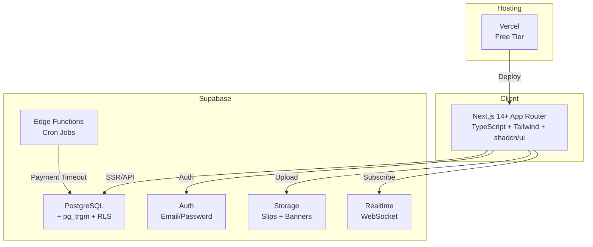
```mermaid
graph TD
    subgraph Client
        A["Next.js 14+ App Router<br/>TypeScript + Tailwind + shadcn/ui"]
    end
    subgraph Supabase
        B["PostgreSQL<br/>+ pg_trgm + RLS"]
        C["Auth<br/>Email/Password"]
        D["Storage<br/>Slips + Banners"]
        E["Realtime<br/>WebSocket"]
        F["Edge Functions<br/>Cron Jobs"]
    end
    subgraph Hosting
        G["Vercel<br/>Free Tier"]
    end
    A -->|SSR/API| B
    A -->|Auth| C
    A -->|Upload| D
    A -->|Subscribe| E
    F -->|Payment Timeout| B
    G -->|Deploy| A
```

| Layer | Technology |
|-------|-----------|
| Frontend | Next.js 14+ (App Router, TypeScript) |
| UI | shadcn/ui + Tailwind CSS |
| Backend/DB | Supabase (PostgreSQL + Auth + Storage + Realtime + Edge Functions) |
| Auth | Supabase Auth — Email/Password only (ไม่มี Social Login) |
| QR | `promptpay-qr` + `qrcode` (client-side) |
| Hosting | Vercel (Free Tier) |

> Supabase Free Tier: 500MB DB, 1GB Storage, 50K Auth users, 50 concurrent connections
> เพียงพอสำหรับ 800–1,500 users

---

## 3. Phase Map

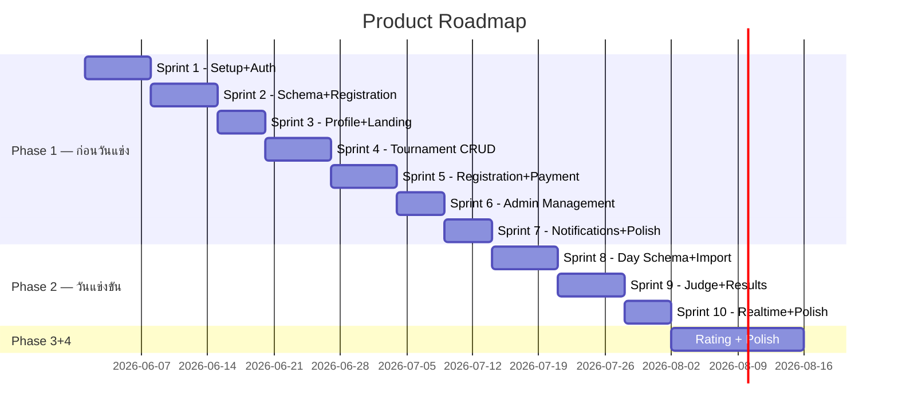
```mermaid
gantt
    title Product Roadmap
    dateFormat YYYY-MM-DD
    section Phase 1 — ก่อนวันแข่ง
    Sprint 1 - Setup+Auth          :s1, 2026-06-01, 7d
    Sprint 2 - Schema+Registration :s2, after s1, 7d
    Sprint 3 - Profile+Landing     :s3, after s2, 5d
    Sprint 4 - Tournament CRUD     :s4, after s3, 7d
    Sprint 5 - Registration+Payment:s5, after s4, 7d
    Sprint 6 - Admin Management    :s6, after s5, 5d
    Sprint 7 - Notifications+Polish:s7, after s6, 5d
    section Phase 2 — วันแข่งขัน
    Sprint 8 - Day Schema+Import   :s8, after s7, 7d
    Sprint 9 - Judge+Results       :s9, after s8, 7d
    Sprint 10 - Realtime+Polish    :s10, after s9, 5d
    section Phase 3+4
    Rating + Polish                :after s10, 14d
```

### Phase Summary

| Phase | Scope | Features |
|:-----:|-------|:--------:|
| **1** | ก่อนวันแข่ง — สมัคร+จ่ายเงิน | 19 features |
| **2** | วันแข่งขัน — check-in, pairing, result, standings, realtime | 10 features (59 decisions) |
| **3** | Rating & History | 4 features |
| **4** | Polish (PWA, Dark Mode) | 4 features |

### ✅ Phase 1 Features

| # | Feature |
|:-:|---------|
| 1 | Auth: Register + Login (Email + Password, Supabase Auth) |
| 2 | Player Profile (1 Player Account = 1 Profile) + Coach Link |
| 3 | Rank Matching (fuzzy search กับ Go Player DB) |
| 4 | Admin: Create Tournament (3 ขั้น) |
| 5 | Admin: Manage Tournament (แก้ไข/ยกเลิก) |
| 6 | Tournament List & Detail |
| 7 | Player: Register for Division (validation) |
| 8 | Payment: PromptPay QR + slip upload + 24hr timeout |
| 9 | Admin: Verify Payments |
| 10 | Admin: Approve Pending Ranks |
| 11 | Player: Cancel Registration |
| 12 | In-App Notifications (admin manual only) |
| 13 | Waiting List (FIFO) |
| 14 | Landing Page (Digital ID Card) |
| 15 | PDPA Consent |
| 16 | Admin: Upload Go Player DB (Excel DAN/KYU/AWARD) |
| 17 | Admin: Promo Codes |
| 18 | Player: Apply Promo Code |
| 19 | Admin: Upload Institute DB |

### ❌ Non-Goals (ไม่ทำเลย)

| Feature | เหตุผล |
|---------|--------|
| Social Login (Google, LINE) | ตัดสินใจแล้ว — ไม่เอา |
| Push Notifications | เสียเงิน — ใช้ in-app text |
| Game Clock / Timer | ใช้นาฬิกาจริง |
| Internal Pairing Algorithm | ใช้ MacMahon ภายนอก + TSV import |

---

## 4. Decisions Locked

> **ทุกข้อด้านล่างตัดสินใจแล้ว ห้ามตีความใหม่หรือเปลี่ยนเอง**

### 4.1 Auth & Account

| # | Decision |
|:-:|----------|
| 1 | Login ด้วย **Email + Password** เท่านั้น (**ไม่มี Username**) |
| 2 | **ไม่มี Social Login** (ไม่มี Google, LINE) |
| 3 | **ไม่ verify email เลย** — ทั้งตอนสมัครและตอนเปลี่ยน email (เพราะ Supabase email quota น้อย) |
| 4 | Forgot Password → **Supabase Auth จัดการอัตโนมัติ** (ใช้ email quota เฉพาะตอน reset เท่านั้น) |
| 5 | Password: **ขั้นต่ำ 8 ตัวอักษร** ไม่บังคับตัวพิมพ์ใหญ่/อักขระพิเศษ + มี **"จำฉันไว้"** checkbox |
| 6 | เบอร์โทร: **รหัสประเทศ + เบอร์** (เช่น +66812345678) |
| 7 | ตอนสมัครเลือกได้เฉพาะ **Player** หรือ **Coach** |
| 8 | **ทุก Account ที่สมัครเป็น Player/Coach = 1 Player Profile เท่านั้น** — สร้าง profile ตัวเองให้เสร็จตอนสมัคร |
| 9 | **Coach Account ไม่มีสิทธิ์สร้าง Player Profile ให้คนอื่น** — เชื่อมได้เฉพาะ Player ที่มีบัญชีอยู่แล้ว |
| 10 | Coach ต้องส่งคำขอ Coach Role ให้ Admin approve ก่อนใช้งานสิทธิ์ Coach |
| 11 | Coach ขอเชื่อมกับ Player ได้; Player ต้องกดอนุมัติเองก่อน Coach สมัคร/ติดตามผลแทนได้ |
| 12 | Referee สมัครเองไม่ได้ — ต้องใช้ **Invite Code จาก Admin** เท่านั้น |
| 13 | Account มีหลาย role ที่ได้รับอนุมัติได้ และผู้ใช้สลับ active role ได้เฉพาะ role ที่ granted แล้ว |
| 14 | แก้ไข Profile ได้: **phone, email** ห้ามแก้: ชื่อ, นามสกุล, วันเกิด, เลข ปชช. (ถ้าสะกดผิด → ติดต่อ Admin) |
| 15 | **ไม่มีรูปโปรไฟล์** |
| 16 | **ลบ Profile ไม่ได้** |

### 4.2 เลขบัตรประชาชนซ้ำ

| # | Decision |
|:-:|----------|
| 1 | เก็บเป็น **SHA-256 + salt hash** เท่านั้น ไม่เก็บเลขจริง |
| 2 | **Passport** สำหรับต่างชาติ — hash เหมือนเลข ปชช. |
| 3 | ถ้า hash ซ้ำ → แสดง error + **email hint 3 ตัวแรก** (`som***@gmail.com`) + ปุ่ม "รีเซ็ตรหัสผ่าน" / "ติดต่อ Admin" |

### 4.3 UI & Display

| # | Decision |
|:-:|----------|
| 1 | วันเกิด: **ปี พ.ศ.** (Buddhist year picker) — เก็บเป็น ค.ศ. — range: ปีปัจจุบัน - 100 ปี |
| 2 | แสดงระดับเป็นภาษาอังกฤษ: **Dan**, **Kyu** |
| 3 | Privacy Policy: **เขียนจริง** (ไม่ใช้ placeholder) — แสดงเป็นหน้า `/privacy` |
| 4 | Admin คนแรก: **seed ใน DB** (สร้าง account + `account_roles.admin` ผ่าน Supabase Dashboard) |

### 4.4 Rank & Power Level

| # | Decision |
|:-:|----------|
| 1 | ลำดับความเก่ง: `9x9(0) → 13x13(1) → 15K(2) → ... → 1K(16) → 1D(17) → ... → 9D(25)` |
| 2 | **สมัครรุ่นเก่งกว่าตัวเองได้ ลงรุ่นอ่อนกว่าไม่ได้** |
| 3 | **อายุกับระดับฝีมือไม่เกี่ยวกัน** |
| 4 | Rank ที่ match กับ DB = **verified**, ผู้ใช้กรอกเอง = **pending** (Admin approve) |
| 5 | ผู้เล่น pending **สมัครแข่งได้** แต่แสดงป้าย ⏳ |
| 6 | Profile rank = **Live Sync** (DB อัปเดต → rank อัปเดตทันที) |
| 7 | Tournament rank = **Snapshot ณ วันเปิดรับสมัคร** |
| 8 | "ไม่ทราบ" rank → **default 15 Kyu** + มี Dropdown ให้เลือกระดับฝีมือเอง |

### 4.5 Rank Matching — Fuzzy Search (3 ชั้น)

| # | Decision |
|:-:|----------|
| 1 | **ชั้น 1: Exact Match** — ชื่อ + นามสกุลตรงเป๊ะ |
| 2 | **ชั้น 2: Normalized Match** — แปลงตัวสะกดสับสน: ศษส→ส, ณน→น, ญย→ย, ภพ→พ, ฎด→ด, ฏต→ต, ฑท→ท, ใไ→ไ, ตัด ์ |
| 3 | **ชั้น 3: Trigram (pg_trgm)** — similarity > 40%, แสดง **สูงสุด 5 คน** ให้เลือก |
| 4 | ไม่เจอเลย → ผู้ใช้กรอก rank เอง → status = pending → Admin approve |

### 4.6 Rank Matching — Database Priority

| # | Decision |
|:-:|----------|
| 1 | Priority: **DAN DB > KYU DB + AWARD DB** |
| 2 | ถ้าชื่ออยู่ใน DAN → ใช้ DAN rank (ไม่ต้องหาใน KYU/AWARD) |
| 3 | ถ้าไม่มีใน DAN → หาใน KYU และ AWARD พร้อมกัน → ใช้ค่าที่เก่งที่สุด |
| 4 | ถ้าไม่มีในทุก DB → 15 Kyu (ถ้า user ไม่กรอกเอง) |
| 5 | KYU DB: ถ้า rank = NULL → ตัดออก, ถ้าซ้ำ → ใช้ rank ดีสุด + วันล่าสุด |
| 6 | KYU DB: rank 16–99999 → ปรับเป็น 15 Kyu |
| 7 | AWARD DB: นับเฉพาะอันดับ 1, 2, 3 เท่านั้น |
| 8 | AWARD DB: คำนวณ rank/power level จาก `rank_in_category` เท่านั้น; `category` เป็น metadata/display/audit ไม่ใช้คำนวณ |
| 9 | AWARD DB: `rank_in_category` แบบช่วง Kyu ใช้สูตร `best_kyu_in_category - 1`, cap ดีสุดที่ 1 Kyu และอ่อนสุดที่ 15 Kyu; `9x9`/`13x13` map เป็น 12 Kyu |

### 4.7 Tournament & Division

| # | Decision |
|:-:|----------|
| 1 | 1 Tournament = หลาย Divisions (รุ่น) |
| 2 | สร้าง Division ทีละรุ่น |
| 3 | แต่ละ Division มีค่า pairing, rounds, komi, กฎ, **ค่าสมัคร** แยกอิสระ |
| 4 | **ค่าสมัครแยกตามรุ่น** (ไม่ใช่ราคาเดียวทั้งรายการ) |
| 5 | Division มี `time_slot`: **morning / afternoon / full_day** |
| 6 | full_day ซ้อนกับทุก time slot, morning ซ้อนกับ morning, afternoon ซ้อนกับ afternoon |
| 7 | Division มี `max_power_level` — บล็อกผู้เล่นที่เก่งเกินไป |
| 8 | Division มี `age_min`, `age_max` (optional, ไม่เกี่ยวกับ rank) |
| 9 | Admin แก้ไขรายการหลัง open ได้ |
| 10 | **แก้ค่าสมัคร** — คนใหม่จ่ายราคาใหม่ คนเก่า Admin manual |
| 11 | **ลบรุ่นที่มีคนสมัคร** → ปิดรับสมัครรุ่นนั้น + Admin คืนเงิน manual |
| 12 | ยกเลิกรายการที่มีคนสมัครแล้ว → **Admin ติดต่อคืนเงินเอง** ผ่านเบอร์โทร |
| 13 | Suggest รุ่นตาม rank แต่ผู้เล่น **เลือกเองได้** |
| 14 | **ลบ Draft** ได้ |
| 15 | เปิด/ปิดรับสมัคร **อัตโนมัติตามวันที่ตั้งไว้** (Admin ปิดก่อนกำหนดได้) |
| 16 | สถานะ: draft → open → closed → in_progress → completed / cancelled |

### 4.8 Payment

| # | Decision |
|:-:|----------|
| 1 | PromptPay QR generate ฝั่ง client (`promptpay-qr`) — **แสดงจำนวนเงินบน QR** |
| 2 | PromptPay ID + ชื่อบัญชี กรอกตอนสร้าง Tournament |
| 3 | **Quota ตัดทันทีตอนกดสมัคร** ไม่ต้องรอจ่ายเงิน |
| 4 | **Timeout 24 ชั่วโมง** — ไม่จ่ายภายใน 24 ชม. → auto-cancel + คืน quota |
| 5 | **จ่ายรวม 1 สลิป** — หลายรุ่น + หลาย linked players ที่ Coach มีสิทธิ์จัดการ = 1 Payment Order |
| 6 | ค่าสมัคร = 0 → ข้ามขั้นจ่ายเงิน → confirmed ทันที |
| 7 | Admin reject สลิป → แจ้ง user ให้ส่งใหม่ + มีปุ่ม reject ตัดชื่อออก |
| 8 | สลิป: **jpg, png** เท่านั้น, max **10 MB** |
| 9 | ภาพปกรายการ: **jpg, png** max **2 MB**, aspect ratio **16:9 หรือ 1:1** |

### 4.9 Promo Code

| # | Decision |
|:-:|----------|
| 1 | Admin สร้าง promo code ได้ตอนสร้าง/แก้ไข tournament |
| 2 | ประเภทส่วนลด: **free** (ฟรี 100%) / **percentage** (ลด %) / **fixed** (ลดจำนวนเงิน) |
| 3 | Code ใช้กับ: **ทั้งรายการ** หรือ **เฉพาะบางรุ่น** |
| 4 | **1 code ต่อ 1 account** ต่อ 1 tournament (ห้ามซ้อน code) |
| 5 | จำกัดจำนวนครั้งการใช้ code ได้ |
| 6 | Admin กำหนด code เอง หรือ ระบบสุ่มให้ |
| 7 | ถ้าใช้ code แล้วค่าสมัคร = 0 → confirmed ทันที |
| 8 | Code มี `is_active` flag + `expires_at` (optional) |

### 4.10 Registration

| # | Decision |
|:-:|----------|
| 1 | ผู้เล่นยกเลิกสมัครได้ → **กรอกเหตุผล** → คืน quota ทันที → ตัดชื่อทันที → Admin คืนเงินเอง |
| 2 | **ยกเลิกได้ถึงก่อนวันแข่ง** |
| 3 | ยกเลิก 1 รุ่นจากหลายรุ่น → **Admin คืนเงิน partial manual** |
| 4 | **Waiting list** — FIFO, ผู้เล่นเห็นลำดับตัวเอง, Promo code ยังใช้ได้เมื่อได้ที่ |
| 5 | Validation: ตรวจ 3 อย่าง → **Power Level + Time Slot + อายุ** |
| 6 | รายชื่อผู้สมัคร **เห็นได้** (แสดงแค่ชื่อ + นามสกุล) |
| 7 | สมัครหลายรุ่น + 1 เต็ม → **จ่ายแค่รุ่นที่ผ่าน** รุ่นเต็มเข้า waiting list |
| 8 | Coach สมัครให้หลาย linked players พร้อมกันได้ — จ่ายยอดรวม 1 สลิป |

### 4.11 Notification

| # | Decision |
|:-:|----------|
| 1 | **ไม่มี notification อัตโนมัติเลย** |
| 2 | **Admin เขียนและส่ง notification เองเท่านั้น** |
| 3 | ส่งได้ถึง: ทุกคน / เฉพาะคนที่สมัครรายการ X / เลือก user |

### 4.12 Tournament Day Decisions (Phase 2)

**Check-in:**

| # | Decision |
|:-:|----------|
| 1 | Check-in เป็น **per-table, per-match** (ดำมาแล้ว / ขาวมาแล้ว) |
| 2 | กรรมการ (`account_roles.referee` active) หรือ Admin กดเช็กชื่อ |
| 3 | สถานะ: `''` → `B` / `W` → `BOTH` (toggle ได้) |
| 4 | เมื่อเช็กชื่อ → อัปเดต `registrations.status = 'checked_in'` ด้วย |
| 5 | ไม่มี deadline อัตโนมัติ — กรรมการตัดสินใจเอง |
| 6 | Walk-in ไม่ได้ (ต้องสมัครผ่านระบบก่อนวันแข่ง) |

**จัดสาย / จับคู่ (Pairing):**

| # | Decision |
|:-:|----------|
| 1 | **ไม่มีระบบจับคู่ในตัว** — ใช้ MacMahon ภายนอก |
| 2 | Admin import TSV file → ระบบ parse + **match ชื่อกับ `player_profiles`** |
| 3 | Name matching: exact → normalized → fuzzy (ถ้าไม่เจอ → manual map) |
| 4 | ถ้า match ได้ → เก็บ `player_profile_id` / ถ้าไม่ได้ → เก็บ `player_name` (string fallback) |
| 5 | **Force Pairing**: Admin/กรรมการ override คู่แข่งได้ทีละโต๊ะ |
| 6 | Force Pair → โต๊ะอื่นที่มีชื่อซ้ำจะ mark "ไม่มีผู้เข้าแข่งขัน" |
| 7 | ชื่อ "BYE" ตัดออกจาก name list |
| 8 | Import ทีละรุ่น ทีละรอบ / ลบรอบแล้ว import ใหม่ได้ |

**กรรมการ (Referee):**

| # | Decision |
|:-:|----------|
| 1 | Login ผ่าน **Supabase Auth** (ใช้ account เดียวกับระบบ, ต้องมี `account_roles.referee` active จาก invite code) |
| 2 | ทำได้: **บันทึกผล, เช็กชื่อ, Force Pairing** |
| 3 | ดูได้ **ทุกโต๊ะ** ในรุ่นที่เลือก (ไม่ต้อง assign ล่วงหน้า) |
| 4 | ผู้เล่นกดบันทึกผลเอง **ไม่ได้** |
| 5 | **ไม่มี game clock** ในแอป (ใช้นาฬิกาจริง) |
| 6 | ทุกการบันทึกเก็บ **account_id + timestamp** (audit trail) |
| 7 | **Round lock**: ทุกโต๊ะส่งผลหมด → lock รอบนั้น |
| 8 | รอบเก่า = read-only |

**บันทึกผลแข่ง:**

| # | Decision |
|:-:|----------|
| 1 | ผลมี **3 แบบ**: `1-0` (ดำชนะ), `0-1` (ขาวชนะ), `?-?` (รอ/ยกเลิก) |
| 2 | **ไม่ต้องใส่คะแนน** (แค่ win/lose) — หมากล้อมไม่มี draw |
| 3 | **ยกเลิกผลได้** → reset เป็น `?-?` + บันทึก cancelled_by + cancelled_at |
| 4 | Forfeit (ไม่มา) → กรรมการกดผลให้ฝั่งที่มาชนะ |
| 5 | ผู้เล่นเห็นผล **ทันที** (Supabase Realtime) |
| 6 | **Round lock**: ทุกโต๊ะส่งผลหมด → lock |
| 7 | รอบเก่า = read-only จากหน้า Judge (Admin ยังแก้ได้) |

**Standings:**

| # | Decision |
|:-:|----------|
| 1 | **ไม่คำนวณคะแนนในระบบ** — import จาก MacMahon เป็น raw table |
| 2 | เก็บเป็น JSONB (headers + rows) → แสดงตามที่ import |
| 3 | อันดับ 1-3 แสดง 🥇🥈🥉 |
| 4 | Admin import ใหม่ทับได้ (UPSERT) |
| 5 | Column "Score" highlight เป็นพิเศษ |

**Live Results:**

| # | Decision |
|:-:|----------|
| 1 | **Public** — ไม่ต้อง login ก็ดูได้ |
| 2 | เลือกรุ่น → เลือกรอบ → เห็นตารางผล (real-time) |
| 3 | **My Status**: ผู้ชม subscribe ติดตามผู้เล่นได้หลายคน |
| 4 | ถ้า **login อยู่** → auto-load ผลของ Player Profile ตัวเอง และ linked players ที่ได้รับอนุมัติ |
| 5 | ถ้า **ไม่ login** → กดเพิ่ม subscription (เก็บ localStorage) |
| 6 | **Toast notification** เมื่อผู้เล่นที่ติดตามมีผลใหม่ |
| 7 | ดูประวัติทุกรอบของผู้เล่นได้ |

**Schedule:**

| # | Decision |
|:-:|----------|
| 1 | Admin **สร้าง schedule template ใน DB** (ไม่ hardcode) |
| 2 | Admin เลือก template ให้แต่ละรุ่น |
| 3 | แสดง **live countdown timer** (สีตาม urgency: 🟢→🟡→🔴) |
| 4 | รองรับ: รอบแข่ง, พักเบรก, พักกลางวัน, พิธีปิด |
| 5 | แสดงทั้งหน้า Judge และ Results |

**Announcements:**

| # | Decision |
|:-:|----------|
| 1 | ใช้ `notifications` table ที่มีอยู่แล้ว (Admin Manual) |
| 2 | เพิ่ม `type = 'announcement'` สำหรับ broadcast วันแข่ง |
| 3 | แสดงเป็น **banner** ด้านบนหน้า Judge + Results |
| 4 | Real-time ผ่าน Supabase Realtime |
| 5 | ข้อความสูงสุด **300 ตัวอักษร** |

---

## 5. Database Schema

### 5.1 ER Diagram

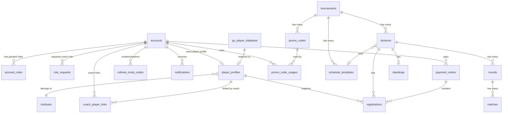
```mermaid
erDiagram
    accounts ||--o{ account_roles : "has granted roles"
    accounts ||--o{ role_requests : "requests coach role"
    accounts ||--o| player_profiles : "owns player profile"
    accounts ||--o{ coach_player_links : "coach links"
    player_profiles ||--o{ coach_player_links : "linked by coach"
    accounts ||--o{ referee_invite_codes : "creates/redeems"
    accounts ||--o{ notifications : receives
    accounts ||--o{ payment_orders : pays
    accounts ||--o{ promo_code_usages : uses
    player_profiles ||--o{ registrations : registers
    player_profiles }o--|| institutes : "belongs to"
    tournaments ||--o{ divisions : "has many"
    tournaments ||--o{ promo_codes : "has many"
    tournaments ||--o{ schedule_templates : "has many"
    divisions ||--o{ registrations : has
    divisions ||--o{ rounds : "has many"
    divisions }o--o| schedule_templates : "uses"
    divisions ||--o| standings : "has"
    rounds ||--o{ matches : "has many"
    payment_orders ||--o{ registrations : contains
    promo_codes ||--o{ promo_code_usages : "used by"
    go_player_database ||--o| player_profiles : "matches to"
```

### 5.2 Phase 1 Tables

> หมายเหตุ migration: SQL ด้านล่างเป็น logical schema; ตอน implement จริงต้องจัดลำดับสร้างตาราง/foreign key ให้ถูก เช่น `institutes` ก่อน `player_profiles`, `promo_codes` ก่อน FK ใน `payment_orders`, และใช้ `ALTER TABLE` สำหรับ FK ที่วน dependency

#### `accounts`
```sql
CREATE TABLE accounts (
  id UUID PRIMARY KEY REFERENCES auth.users(id) ON DELETE CASCADE,
  email TEXT UNIQUE NOT NULL,
  phone TEXT NOT NULL,
  active_role TEXT NOT NULL DEFAULT 'player' CHECK (active_role IN ('player', 'coach', 'referee', 'admin')),
  is_active BOOLEAN NOT NULL DEFAULT true,
  created_at TIMESTAMPTZ NOT NULL DEFAULT now(),
  last_login_at TIMESTAMPTZ
);
-- Note: password managed by Supabase Auth; accounts.id = auth.users.id
```

#### `account_roles`
```sql
CREATE TABLE account_roles (
  id UUID PRIMARY KEY DEFAULT gen_random_uuid(),
  account_id UUID NOT NULL REFERENCES accounts(id) ON DELETE CASCADE,
  role TEXT NOT NULL CHECK (role IN ('player', 'coach', 'referee', 'admin')),
  status TEXT NOT NULL DEFAULT 'active' CHECK (status IN ('active', 'suspended', 'revoked')),
  granted_by UUID REFERENCES accounts(id),
  granted_at TIMESTAMPTZ DEFAULT now(),
  revoked_at TIMESTAMPTZ,
  UNIQUE(account_id, role)
);
```

#### `role_requests`
```sql
CREATE TABLE role_requests (
  id UUID PRIMARY KEY DEFAULT gen_random_uuid(),
  account_id UUID NOT NULL REFERENCES accounts(id) ON DELETE CASCADE,
  requested_role TEXT NOT NULL CHECK (requested_role IN ('coach')),
  status TEXT NOT NULL DEFAULT 'pending' CHECK (status IN ('pending', 'approved', 'rejected', 'cancelled')),
  reason TEXT,
  reviewed_by UUID REFERENCES accounts(id),
  reviewed_at TIMESTAMPTZ,
  admin_note TEXT,
  created_at TIMESTAMPTZ DEFAULT now(),
  UNIQUE(account_id, requested_role)
);
```

#### `referee_invite_codes`
```sql
CREATE TABLE referee_invite_codes (
  id UUID PRIMARY KEY DEFAULT gen_random_uuid(),
  code_hash TEXT UNIQUE NOT NULL,
  status TEXT NOT NULL DEFAULT 'unused' CHECK (status IN ('unused', 'redeemed', 'expired', 'revoked')),
  created_by UUID NOT NULL REFERENCES accounts(id),
  redeemed_by UUID REFERENCES accounts(id),
  expires_at TIMESTAMPTZ,
  redeemed_at TIMESTAMPTZ,
  created_at TIMESTAMPTZ DEFAULT now()
);
```

#### `player_profiles`
```sql
CREATE TABLE player_profiles (
  id UUID PRIMARY KEY DEFAULT gen_random_uuid(),
  account_id UUID NOT NULL REFERENCES accounts(id) ON DELETE CASCADE,
  title_th TEXT NOT NULL,
  title_en TEXT NOT NULL,
  first_name_th TEXT NOT NULL,
  middle_name_th TEXT,
  last_name_th TEXT NOT NULL,
  first_name_en TEXT NOT NULL,
  middle_name_en TEXT,
  last_name_en TEXT NOT NULL,
  gender TEXT NOT NULL CHECK (gender IN ('male', 'female', 'unspecified')),
  date_of_birth DATE NOT NULL,
  identity_document_type TEXT NOT NULL CHECK (identity_document_type IN ('national_id', 'passport')),
  identity_document_hash TEXT UNIQUE NOT NULL,
  nationality TEXT NOT NULL DEFAULT 'Thai',
  institute_name TEXT,                   -- free text fallback
  phone TEXT NOT NULL,
  rank TEXT NOT NULL DEFAULT '15 Kyu',
  rank_status TEXT NOT NULL DEFAULT 'pending' CHECK (rank_status IN ('verified', 'pending')),
  power_level INT NOT NULL DEFAULT 2,
  rating NUMERIC,
  matched_go_player_id UUID REFERENCES go_player_database(id) ON DELETE SET NULL,
  created_at TIMESTAMPTZ NOT NULL DEFAULT now(),
  UNIQUE(account_id)
);
```

#### `coach_player_links`
```sql
CREATE TABLE coach_player_links (
  id UUID PRIMARY KEY DEFAULT gen_random_uuid(),
  coach_account_id UUID NOT NULL REFERENCES accounts(id) ON DELETE CASCADE,
  player_profile_id UUID NOT NULL REFERENCES player_profiles(id) ON DELETE CASCADE,
  status TEXT NOT NULL DEFAULT 'pending' CHECK (status IN ('pending', 'approved', 'rejected', 'revoked')),
  requested_at TIMESTAMPTZ DEFAULT now(),
  responded_at TIMESTAMPTZ,
  revoked_at TIMESTAMPTZ,
  note TEXT,
  UNIQUE(coach_account_id, player_profile_id)
);
```

#### `institutes`
```sql
CREATE TABLE institutes (
  id UUID PRIMARY KEY DEFAULT gen_random_uuid(),
  seq INT,
  name TEXT NOT NULL UNIQUE,
  keywords TEXT,                    -- ชื่ออื่น ๆ คั่นด้วย |
  is_active BOOLEAN DEFAULT true,
  created_at TIMESTAMPTZ DEFAULT now()
);
CREATE INDEX idx_institutes_name_trgm ON institutes USING gin (name gin_trgm_ops);
```

#### `go_player_database`
```sql
CREATE TABLE go_player_database (
  id UUID PRIMARY KEY DEFAULT gen_random_uuid(),
  source TEXT NOT NULL CHECK (source IN ('dan', 'kyu', 'award')),
  seq TEXT,
  prefix_th TEXT,
  first_name_th TEXT NOT NULL,
  last_name_th TEXT NOT NULL,
  first_name_th_normalized TEXT NOT NULL,
  last_name_th_normalized TEXT NOT NULL,
  rank TEXT,
  power_level INT NOT NULL DEFAULT 0,
  rating INT,
  year_promoted INT,
  diamond TEXT,
  category TEXT,
  rank_in_category TEXT,
  rank_award INT,
  event_name TEXT,
  event_date TEXT,
  raw_data JSONB,
  uploaded_at TIMESTAMPTZ DEFAULT now()
);
CREATE EXTENSION IF NOT EXISTS pg_trgm;
CREATE INDEX idx_go_player_fname_trgm ON go_player_database USING gin (first_name_th gin_trgm_ops);
CREATE INDEX idx_go_player_lname_trgm ON go_player_database USING gin (last_name_th gin_trgm_ops);
CREATE INDEX idx_go_player_source ON go_player_database (source);
```

#### `tournaments`
```sql
CREATE TABLE tournaments (
  id UUID PRIMARY KEY DEFAULT gen_random_uuid(),
  name TEXT NOT NULL,
  description TEXT,
  location TEXT NOT NULL,
  location_url TEXT,
  banner_url TEXT,
  registration_open_date DATE NOT NULL,
  registration_close_date DATE NOT NULL,
  start_date DATE NOT NULL,
  end_date DATE,
  promptpay_id TEXT,
  promptpay_name TEXT,
  bank_name TEXT,
  payment_timeout_hours INT DEFAULT 24,
  status TEXT NOT NULL DEFAULT 'draft' CHECK (status IN ('draft', 'open', 'closed', 'in_progress', 'completed', 'cancelled')),
  created_by UUID NOT NULL REFERENCES accounts(id),
  created_at TIMESTAMPTZ DEFAULT now()
);
```

#### `divisions`
```sql
CREATE TABLE divisions (
  id UUID PRIMARY KEY DEFAULT gen_random_uuid(),
  tournament_id UUID NOT NULL REFERENCES tournaments(id) ON DELETE CASCADE,
  name TEXT NOT NULL,
  board_size TEXT NOT NULL CHECK (board_size IN ('9x9', '13x13', '19x19')),
  time_slot TEXT NOT NULL CHECK (time_slot IN ('morning', 'afternoon', 'full_day')),
  pairing_system TEXT NOT NULL CHECK (pairing_system IN ('mcmahon', 'swiss', 'round_robin')),
  total_rounds INT NOT NULL,
  komi NUMERIC(3,1) DEFAULT 6.5,
  rules TEXT NOT NULL CHECK (rules IN ('Japanese', 'Chinese', 'AGA')),
  entry_fee INT NOT NULL DEFAULT 0,
  max_players INT,
  max_power_level INT,
  rank_min TEXT,
  rank_max TEXT,
  age_min INT,
  age_max INT,
  sort_order INT DEFAULT 0,
  schedule_template_id UUID,              -- Added in Phase 2
  created_at TIMESTAMPTZ DEFAULT now()
);
```

#### `payment_orders`
```sql
CREATE TABLE payment_orders (
  id UUID PRIMARY KEY DEFAULT gen_random_uuid(),
  account_id UUID NOT NULL REFERENCES accounts(id),
  tournament_id UUID NOT NULL REFERENCES tournaments(id),
  total_amount INT NOT NULL,
  discount_amount INT DEFAULT 0,
  final_amount INT NOT NULL,
  promo_code_id UUID REFERENCES promo_codes(id),
  status TEXT NOT NULL DEFAULT 'pending_payment' CHECK (status IN ('pending_payment', 'pending_verify', 'confirmed', 'expired', 'cancelled')),
  slip_url TEXT,
  verified_by UUID REFERENCES accounts(id),
  expires_at TIMESTAMPTZ NOT NULL,
  paid_at TIMESTAMPTZ,
  verified_at TIMESTAMPTZ,
  created_at TIMESTAMPTZ DEFAULT now()
);
```

#### `promo_codes`
```sql
CREATE TABLE promo_codes (
  id UUID PRIMARY KEY DEFAULT gen_random_uuid(),
  tournament_id UUID NOT NULL REFERENCES tournaments(id) ON DELETE CASCADE,
  code TEXT NOT NULL,
  discount_type TEXT NOT NULL CHECK (discount_type IN ('free', 'percentage', 'fixed')),
  discount_value INT NOT NULL DEFAULT 100,
  applicable_division_ids UUID[] DEFAULT NULL,  -- NULL = ทุกรุ่น
  max_uses INT,                                  -- NULL = ไม่จำกัด
  current_uses INT DEFAULT 0,
  is_active BOOLEAN DEFAULT true,
  expires_at TIMESTAMPTZ,
  created_at TIMESTAMPTZ DEFAULT now(),
  UNIQUE(tournament_id, code)
);
```

#### `promo_code_usages`
```sql
CREATE TABLE promo_code_usages (
  id UUID PRIMARY KEY DEFAULT gen_random_uuid(),
  promo_code_id UUID NOT NULL REFERENCES promo_codes(id),
  account_id UUID NOT NULL REFERENCES accounts(id),
  payment_order_id UUID REFERENCES payment_orders(id),
  discount_amount INT NOT NULL,
  used_at TIMESTAMPTZ DEFAULT now(),
  UNIQUE(promo_code_id, account_id)  -- 1 code ต่อ 1 คน ต่อ tournament
);
```

#### `registrations`
```sql
CREATE TABLE registrations (
  id UUID PRIMARY KEY DEFAULT gen_random_uuid(),
  division_id UUID NOT NULL REFERENCES divisions(id),
  player_profile_id UUID NOT NULL REFERENCES player_profiles(id),
  registered_by_account_id UUID NOT NULL REFERENCES accounts(id),
  payment_order_id UUID REFERENCES payment_orders(id),
  status TEXT NOT NULL DEFAULT 'pending_payment' CHECK (status IN ('pending_payment', 'pending_verify', 'confirmed', 'waiting_list', 'cancelled', 'checked_in')),
  snapshot_rank TEXT,
  snapshot_rating INT,
  snapshot_power_level INT,
  cancel_reason TEXT,
  registered_at TIMESTAMPTZ DEFAULT now(),
  UNIQUE(division_id, player_profile_id)
);
```

#### `notifications`
```sql
CREATE TABLE notifications (
  id UUID PRIMARY KEY DEFAULT gen_random_uuid(),
  account_id UUID NOT NULL REFERENCES accounts(id),
  sent_by UUID REFERENCES accounts(id),
  title TEXT NOT NULL,
  body TEXT NOT NULL,
  link TEXT,
  is_read BOOLEAN DEFAULT false,
  created_at TIMESTAMPTZ DEFAULT now()
);
```

#### `pdpa_consents`
```sql
CREATE TABLE pdpa_consents (
  id UUID PRIMARY KEY DEFAULT gen_random_uuid(),
  account_id UUID NOT NULL REFERENCES accounts(id),
  consent_version TEXT NOT NULL DEFAULT 'v1.0',
  ip_address TEXT,
  consented_at TIMESTAMPTZ DEFAULT now()
);
```

### 5.3 Phase 2 Tables (วันแข่งขัน)

#### `rounds`
```sql
CREATE TABLE rounds (
  id UUID PRIMARY KEY DEFAULT gen_random_uuid(),
  division_id UUID NOT NULL REFERENCES divisions(id) ON DELETE CASCADE,
  round_number INT NOT NULL,
  status TEXT DEFAULT 'pending' CHECK (status IN ('pending', 'in_progress', 'completed')),
  started_at TIMESTAMPTZ,
  completed_at TIMESTAMPTZ,
  UNIQUE(division_id, round_number)
);
```

#### `matches`
```sql
CREATE TABLE matches (
  id UUID PRIMARY KEY DEFAULT gen_random_uuid(),
  round_id UUID NOT NULL REFERENCES rounds(id) ON DELETE CASCADE,
  table_number INT NOT NULL,
  -- System pairing (จาก MacMahon import)
  player_black_id UUID REFERENCES player_profiles(id),
  player_white_id UUID REFERENCES player_profiles(id),
  player_black_name TEXT NOT NULL,
  player_white_name TEXT NOT NULL,
  -- Force pairing override
  force_black_name TEXT,
  force_white_name TEXT,
  -- Result
  result TEXT NOT NULL DEFAULT '?-?' CHECK (result IN ('1-0', '0-1', '?-?')),
  -- Check-in
  checkin TEXT NOT NULL DEFAULT '' CHECK (checkin IN ('', 'B', 'W', 'BOTH')),
  -- Audit
  submitted_by UUID REFERENCES accounts(id),
  submitted_at TIMESTAMPTZ,
  cancelled_by UUID REFERENCES accounts(id),
  cancelled_at TIMESTAMPTZ,
  remark TEXT,
  UNIQUE(round_id, table_number)
);
```

#### `standings`
```sql
CREATE TABLE standings (
  id UUID PRIMARY KEY DEFAULT gen_random_uuid(),
  division_id UUID NOT NULL UNIQUE REFERENCES divisions(id) ON DELETE CASCADE,
  headers JSONB NOT NULL,               -- ["Place","Name","Score","R1","R2","SOS"]
  rows JSONB NOT NULL,                  -- [["1","สมชาย","5","+","+","20.0"], ...]
  imported_at TIMESTAMPTZ DEFAULT now(),
  imported_by UUID REFERENCES accounts(id)
);
```

#### `schedule_templates`
```sql
CREATE TABLE schedule_templates (
  id UUID PRIMARY KEY DEFAULT gen_random_uuid(),
  tournament_id UUID NOT NULL REFERENCES tournaments(id) ON DELETE CASCADE,
  name TEXT NOT NULL,
  events JSONB NOT NULL,
  -- events format:
  -- [
  --   { "time": "08:30", "label": "ลงทะเบียน", "type": "break", "duration_min": 30 },
  --   { "time": "09:00", "label": "รอบ 1", "type": "round", "duration_min": 60 },
  --   ...
  -- ]
  created_at TIMESTAMPTZ DEFAULT now()
);

-- Link division → schedule template
ALTER TABLE divisions ADD COLUMN schedule_template_id UUID REFERENCES schedule_templates(id);
```

### 5.4 Power Level Lookup Table

```
9x9           → 0     (อ่อนสุด)
13x13         → 1
15 Kyu        → 2
14 Kyu        → 3
13 Kyu        → 4
12 Kyu        → 5
11 Kyu        → 6
10 Kyu        → 7
9 Kyu         → 8
8 Kyu         → 9
7 Kyu         → 10
6 Kyu         → 11
5 Kyu         → 12
4 Kyu         → 13
3 Kyu         → 14
2 Kyu         → 15
1 Kyu         → 16
1 Dan         → 17
2 Dan         → 18
3 Dan         → 19
4 Dan         → 20
5 Dan         → 21
6 Dan         → 22
7 Dan         → 23
8 Dan         → 24
9 Dan         → 25    (เก่งสุด)
```

**สูตร:**
- Kyu: `power_level = 17 - kyu_number` (15K=2, 14K=3, ..., 1K=16)
- Dan: `power_level = 16 + dan_number` (1D=17, 2D=18, ..., 9D=25)

### 5.5 AWARD DB `rank_in_category` Map

| rank_in_category | Award Kyu | Rank (after -1) |
|-----------------|:---------:|:---------------:|
| 9x9 (any placement) | 12 | **12 Kyu** |
| 13x13 (any placement) | 12 | **12 Kyu** |
| 13-15 Kyu | 12 | **12 Kyu** |
| 10-12 Kyu | 9 | **9 Kyu** |
| 10-15 Kyu | 9 | **9 Kyu** |
| 7-9 Kyu | 6 | **6 Kyu** |
| 7-12 Kyu | 6 | **6 Kyu** |
| 4-6 Kyu | 3 | **3 Kyu** |
| 4-9 Kyu | 3 | **3 Kyu** |
| 1-6 Kyu | 3 | **3 Kyu** |
| 1-3 Kyu | 2 | **2 Kyu** |
| 1-2 Kyu | 1 | **1 Kyu** |
| 1 Kyu | 1 | **1 Kyu** |

> คำนวณจาก `rank_in_category` เท่านั้น: `best_kyu_in_category - 1`, cap ที่ 1 Kyu
> ถ้า `rank_in_category` เป็นช่วง Kyu ที่ไม่มีในตาราง เช่น `9-12 Kyu`, `7-8 Kyu`, `5-6 Kyu`, `9-12` ให้ใช้สูตรเดียวกันจากเลข Kyu ที่ดีที่สุดในช่วง และ cap อ่อนสุดที่ 15 Kyu
> `rank_award` ใช้กรองเฉพาะ placement = 1, 2, 3 เท่านั้น
> `category` เก็บไว้เป็น metadata/display/audit เท่านั้น ไม่ใช้คำนวณ rank หรือ power_level

### 5.6 Excel Format Reference

**DAN Database** (`source = 'dan'`, full refresh on upload)

| Excel Column | DB Column | หมายเหตุ |
|:-------------|:----------|---------|
| `seq` | `seq` | หมายเลขประจำตัว (TEXT) |
| `prefix` | `prefix_th` | คำนำหน้า |
| `firstname` | `first_name_th` | ชื่อ |
| `lastname` | `last_name_th` | นามสกุล |
| `year` | `year_promoted` | ปี พ.ศ. ที่ขึ้นดั้ง |
| `rank` | `rank` | ระดับดั้ง → "X Dan" |
| `diamond` | `diamond` | เก็บ string โชว์เฉย ๆ |
| `gat` | `rating` | คะแนน |

Parsing: `rank` (number) → `"X Dan"`, `power_level = 16 + X`

**KYU Database** (`source = 'kyu'`, full refresh on upload)

| Excel Column | DB Column | หมายเหตุ |
|:-------------|:----------|---------|
| `seq` | `seq` | หมายเลข |
| `prefix` | `prefix_th` | คำนำหน้า |
| `firstname` | `first_name_th` | ชื่อ |
| `lastname` | `last_name_th` | นามสกุล |
| `rank` | `rank` | ระดับคิว → "X Kyu" |
| `date` | `event_date` | วันเดือนปี |

Parsing Rules:
1. ถ้า `rank` = NULL/empty → **ตัดแถวออก**
2. ถ้า `rank` = 16–99999 → **ปรับเป็น 15 Kyu** (power_level = 2)
3. ถ้าชื่อ+นามสกุลซ้ำ → ใช้ **rank ที่เลขน้อยสุด** (เก่งสุด)
4. `rank` (number) → `"X Kyu"`, `power_level = 17 - X`

**AWARD Database** (`source = 'award'`, full refresh on upload)

| Excel Column | DB Column | หมายเหตุ |
|:-------------|:----------|---------|
| `seq` | `seq` | เก็บไว้เฉย ๆ |
| `prefix` | `prefix_th` | เก็บไว้เฉย ๆ |
| `firstname` | `first_name_th` | ชื่อ |
| `lastname` | `last_name_th` | นามสกุล |
| `phone` | `raw_data.phone` | เก็บไว้เฉย ๆ |
| `category` | `category` | ชื่อรุ่น เก็บเป็น metadata/display/audit เท่านั้น ไม่ใช้คำนวณ |
| `rank_in_category` | `rank_in_category` | field เดียวที่ใช้ map rank/power_level |
| `rank_award` | `rank_award` | อันดับที่ได้ ใช้กรองเฉพาะ 1, 2, 3 |
| `event_name` | `event_name` | เก็บไว้เฉย ๆ |
| `date` | `event_date` | เก็บไว้เฉย ๆ |
| `organizer` | `raw_data.organizer` | เก็บไว้เฉย ๆ |

Parsing: นับเฉพาะ `rank_award` = 1, 2, 3; คำนวณจาก `rank_in_category` ตาม AWARD `rank_in_category` Map

**Institute Database** (full refresh on upload)

| Excel Column | DB Column | หมายเหตุ |
|:-------------|:----------|---------|
| `seq` | `seq` | หมายเลข |
| `name` | `name` | ชื่อสถาบัน (e.g. "Buddy GO") |
| `keywords` | `keywords` | ชื่ออื่น คั่น `|` (e.g. "โกะเด็กม่อน") |

### 5.7 RLS Policies — Phase 1

| Table | Policy | Rule |
|-------|--------|------|
| `accounts` | Read | ทุกคนดูข้อมูลสาธารณะ |
| `accounts` | Update | แก้ไขได้เฉพาะบัญชีตัวเอง |
| `account_roles` | Read | เจ้าของบัญชี + Admin |
| `account_roles` | Insert/Update/Delete | เฉพาะ Admin หรือ system flow ที่ redeem referee invite สำเร็จ |
| `role_requests` | Insert | เจ้าของบัญชีส่งคำขอ Coach ได้ |
| `role_requests` | Read | เจ้าของคำขอ + Admin |
| `role_requests` | Update | Admin approve/reject; เจ้าของยกเลิกได้เฉพาะ pending |
| `referee_invite_codes` | Insert/Update | เฉพาะ Admin |
| `referee_invite_codes` | Redeem | User ที่มี code ถูกต้อง redeem ได้ครั้งเดียวและสร้าง `account_roles.referee` |
| `player_profiles` | Read | ทุกคนดูข้อมูลสาธารณะ — **ไม่แสดง national_id_hash** |
| `player_profiles` | Insert | เฉพาะ Player signup สร้าง profile ของ account ตัวเองได้ 1 profile |
| `player_profiles` | Update | ผ่าน trusted server action เท่านั้น: เจ้าของ profile แก้ phone/email ได้; Admin แก้ rank/status ได้ |
| `coach_player_links` | Insert | Coach ที่มี role active ส่งคำขอ link ถึง Player ที่มีบัญชีอยู่แล้ว |
| `coach_player_links` | Read | Coach เจ้าของคำขอ, Player เจ้าของ profile, Admin |
| `coach_player_links` | Update | Player approve/reject; Coach revoke; Admin revoke |
| `registrations` | Insert | Player สมัคร profile ตัวเอง หรือ Coach สมัครให้ linked player ที่ status = approved |
| `registrations` | Read | ทุกคนดูรายชื่อ (เห็นแค่ชื่อ + นามสกุล) |
| `tournaments` | Insert/Update | เฉพาะ Admin |
| `tournaments` | Read | ทุกคนดูได้ |
| `divisions` | Read | ทุกคนดูได้ |
| `divisions` | Insert/Update/Delete | เฉพาะ Admin |
| `payment_orders` | Insert | เจ้าของบัญชี |
| `payment_orders` | Read | เจ้าของ + Admin |
| `payment_orders` | Update | Admin (verify), เจ้าของ (upload slip) |
| `notifications` | Read | เจ้าของบัญชี |
| `pdpa_consents` | Insert | เจ้าของบัญชี |

### 5.8 RLS Policies — Phase 2

```sql
-- rounds: ทุกคนอ่านได้, Admin เท่านั้นเขียน
CREATE POLICY rounds_read ON rounds FOR SELECT USING (true);
CREATE POLICY rounds_write ON rounds FOR ALL USING (is_admin());

-- matches: ทุกคนอ่านได้, กรรมการ+Admin เขียน result/checkin
CREATE POLICY matches_read ON matches FOR SELECT USING (true);
CREATE POLICY matches_result ON matches FOR UPDATE
  USING (is_referee_or_admin())
  WITH CHECK (is_referee_or_admin());

-- standings: ทุกคนอ่านได้, Admin เท่านั้นเขียน
CREATE POLICY standings_read ON standings FOR SELECT USING (true);
CREATE POLICY standings_write ON standings FOR ALL USING (is_admin());

-- Helper functions
CREATE FUNCTION is_referee_or_admin() RETURNS BOOLEAN AS $$
  SELECT EXISTS (
    SELECT 1 FROM account_roles
    WHERE account_id = auth.uid()
    AND role IN ('referee', 'admin')
    AND status = 'active'
  );
$$ LANGUAGE sql SECURITY DEFINER;
```

---

## 6. Domain Rules & Business Logic

### 6.1 Rank Matching Algorithm

```
INPUT: first_name_th, last_name_th
OUTPUT: { rank, power_level, source, matched_records[] }

1. Search DAN DB (exact → normalized → trigram)
   → if found: return DAN rank, stop

2. Search KYU DB + AWARD DB in parallel
   → if found in both: use the one with HIGHER power_level
   → if found in one: use that

3. If not found in any:
   → show "ไม่พบข้อมูลในระบบ"
   → let user self-declare rank → status = pending
```

### 6.2 Thai Name Normalization

```javascript
function normalizeThaiName(name) {
  return name
    .replace(/[ศษ]/g, 'ส')
    .replace(/ณ/g, 'น')
    .replace(/ญ/g, 'ย')
    .replace(/ภ/g, 'พ')
    .replace(/ฎ/g, 'ด')
    .replace(/ฏ/g, 'ต')
    .replace(/ฑ/g, 'ท')
    .replace(/ใ/g, 'ไ')
    .replace(/์/g, '');
    // ร↔ล: configurable, off by default
}
```

### 6.3 Registration Validation

```
When player registers for a division, check ALL 3:

1. POWER LEVEL CHECK
   if player.power_level > division.max_power_level → BLOCK ❌
   (สมัครรุ่นเก่งกว่าตัวเองได้เสมอ)

2. TIME SLOT CHECK
   existing = divisions player already registered for in this tournament
   for each existing_div:
     if conflict(existing_div.time_slot, new_div.time_slot) → BLOCK ❌

   conflict(a, b):
     if a == 'full_day' OR b == 'full_day' → true
     if a == b → true
     else → false

3. AGE CHECK (if division has age_min/age_max)
   age = calculate_age(player.date_of_birth, tournament.start_date)
   if age_min and age < age_min → BLOCK ❌
   if age_max and age > age_max → BLOCK ❌
```

### 6.4 Payment Flow

```
REGISTER:
  1. Validate registration (3 checks above)
  2. Deduct quota immediately (quota -= 1)
  3. Apply promo code (if provided):
     a. Validate: code exists, is_active, not expired, current_uses < max_uses
     b. Validate: 1 code per account per tournament
     c. Validate: applicable_division_ids (NULL=all, or check match)
     d. Calculate discount:
        - free → final = 0
        - percentage → final = total * (100 - discount_value) / 100
        - fixed → final = max(0, total - discount_value)
     e. Create promo_code_usage record
     f. Increment promo_codes.current_uses += 1
  4. If final_amount == 0: status = confirmed, done
  5. If final_amount > 0:
     a. Create payment_order (expires_at = now + 24h)
     b. Create registrations (status = pending_payment)
     c. Show PromptPay QR with final_amount

UPLOAD SLIP:
  1. Upload to Supabase Storage
  2. Update payment_order: slip_url, status = pending_verify, paid_at = now
  3. Update registrations: status = pending_verify

ADMIN APPROVE:
  1. payment_order.status = confirmed, verified_by, verified_at
  2. All linked registrations.status = confirmed

ADMIN REJECT:
  Option A: "ส่งสลิปใหม่" → status back to pending_payment
  Option B: "ตัดชื่อออก" → status = cancelled, quota += 1

TIMEOUT (Supabase Edge Function cron ทุก 5 นาที):
  For each payment_order where status = pending_payment AND expires_at < now:
    1. payment_order.status = expired
    2. All linked registrations.status = cancelled
    3. quota += N

PLAYER CANCEL:
  1. Player provides cancel_reason (required)
  2. registration.status = cancelled
  3. quota += 1 (immediately)
  4. Admin considers refund manually (via phone)
```

### 6.5 Waiting List

```
WHEN quota is full:
  1. Registration created with status = waiting_list
  2. No payment required yet

WHEN a spot opens (cancel/timeout):
  1. Find oldest waiting_list registration (FIFO — ORDER BY registered_at ASC)
  2. Change status to pending_payment
  3. Start 24h payment timer
```

---

## 7. Design System

### 🎨 Pastel Gradient + Glassmorphism

#### Color Palette

```css
/* ===== Core Palette ===== */
--bg-gradient-start:   hsl(20, 100%, 95%);    /* Warm peach */
--bg-gradient-mid:     hsl(300, 60%, 95%);     /* Soft pink */
--bg-gradient-end:     hsl(260, 60%, 95%);     /* Light lavender */

/* ===== Primary (CTA Buttons, Active States) ===== */
--primary-start:       hsl(340, 80%, 60%);     /* Hot pink */
--primary-end:         hsl(270, 80%, 65%);     /* Purple */

/* ===== Status Badges ===== */
--status-confirmed:    hsl(145, 70%, 55%);     /* Green */
--status-pending:      hsl(40, 95%, 55%);      /* Amber */
--status-waiting:      hsl(220, 80%, 60%);     /* Blue */
--status-cancelled:    hsl(0, 70%, 60%);       /* Red */
--status-in-progress:  hsl(280, 70%, 60%);     /* Purple */
--status-draft:        hsl(0, 0%, 70%);        /* Gray */

/* ===== Surface (Cards, Modals) ===== */
--glass-bg:            rgba(255, 255, 255, 0.72);
--glass-border:        rgba(255, 255, 255, 0.5);
--glass-shadow:        0 8px 32px rgba(0, 0, 0, 0.06);
--glass-blur:          blur(20px);

/* ===== Text ===== */
--text-primary:        hsl(240, 20%, 15%);
--text-secondary:      hsl(240, 10%, 50%);
--text-on-gradient:    #ffffff;
```

#### Typography

```css
@import url('https://fonts.googleapis.com/css2?family=Inter:wght@400;500;600;700&family=Noto+Sans+Thai:wght@400;500;600;700&display=swap');

--font-family:  'Inter', 'Noto Sans Thai', sans-serif;
--text-xs:      0.75rem;   /* 12px */
--text-sm:      0.875rem;  /* 14px */
--text-base:    1rem;      /* 16px */
--text-lg:      1.125rem;  /* 18px */
--text-xl:      1.25rem;   /* 20px */
--text-2xl:     1.5rem;    /* 24px */
--text-3xl:     1.875rem;  /* 30px */
```

#### Spacing & Radius

```css
--radius-sm:    8px;
--radius-md:    12px;
--radius-lg:    16px;
--radius-xl:    20px;
--radius-full:  9999px;
--space-page:   16px;
--space-card:   20px;
--space-gap:    12px;
```

#### Component Tokens

| Component | Style |
|-----------|-------|
| **Page Background** | `linear-gradient(160deg, peach, pink, lavender)` — full viewport, fixed |
| **Glass Card** | `bg: --glass-bg`, `backdrop-filter: blur(20px)`, `border: 1px solid --glass-border`, `border-radius: 16px`, `box-shadow: --glass-shadow` |
| **Primary Button** | `background: linear-gradient(135deg, hot-pink, purple)`, `color: white`, `border-radius: 9999px`, `height: 48px`, `font-weight: 600` |
| **Secondary Button** | `background: white`, `border: 1px solid #e5e5e5`, `border-radius: 9999px` |
| **Input Field** | `background: white`, `border: 1px solid #e8e8e8`, `border-radius: 12px`, `height: 48px` |
| **Status Badge** | `border-radius: 9999px`, `padding: 4px 12px`, `font-size: 12px`, `font-weight: 600` |
| **Progress Bar** | `height: 6px`, `border-radius: 9999px`, `background: #f0f0f0`, filled with gradient |

#### Animations

```css
--transition-default:  all 0.2s ease;
--transition-smooth:   all 0.3s cubic-bezier(0.4, 0, 0.2, 1);

.card:active { transform: scale(0.98); }
.btn-primary:hover { transform: translateY(-1px); box-shadow: 0 6px 20px rgba(0,0,0,0.12); }

@keyframes page-enter {
  from { opacity: 0; transform: translateY(12px); }
  to   { opacity: 1; transform: translateY(0); }
}

@keyframes shimmer {
  0% { background-position: -200% 0; }
  100% { background-position: 200% 0; }
}
```

#### Layout Constraints

```css
/* User-facing pages: Mobile-Only */
.app-container {
  max-width: 430px;
  margin: 0 auto;
  min-height: 100dvh;
  position: relative;
  overflow-x: hidden;
}

@media (min-width: 431px) {
  body { background: linear-gradient(160deg, var(--bg-gradient-start), var(--bg-gradient-mid), var(--bg-gradient-end)); }
  .app-container { box-shadow: 0 0 60px rgba(0, 0, 0, 0.08); }
}

/* Admin pages: Desktop layout */
.admin-container {
  display: grid;
  grid-template-columns: 240px 1fr;
  min-height: 100vh;
}
```

---

## 8. Application Flows — Phase 1

### Flow 0: สมัครสมาชิก (Register)

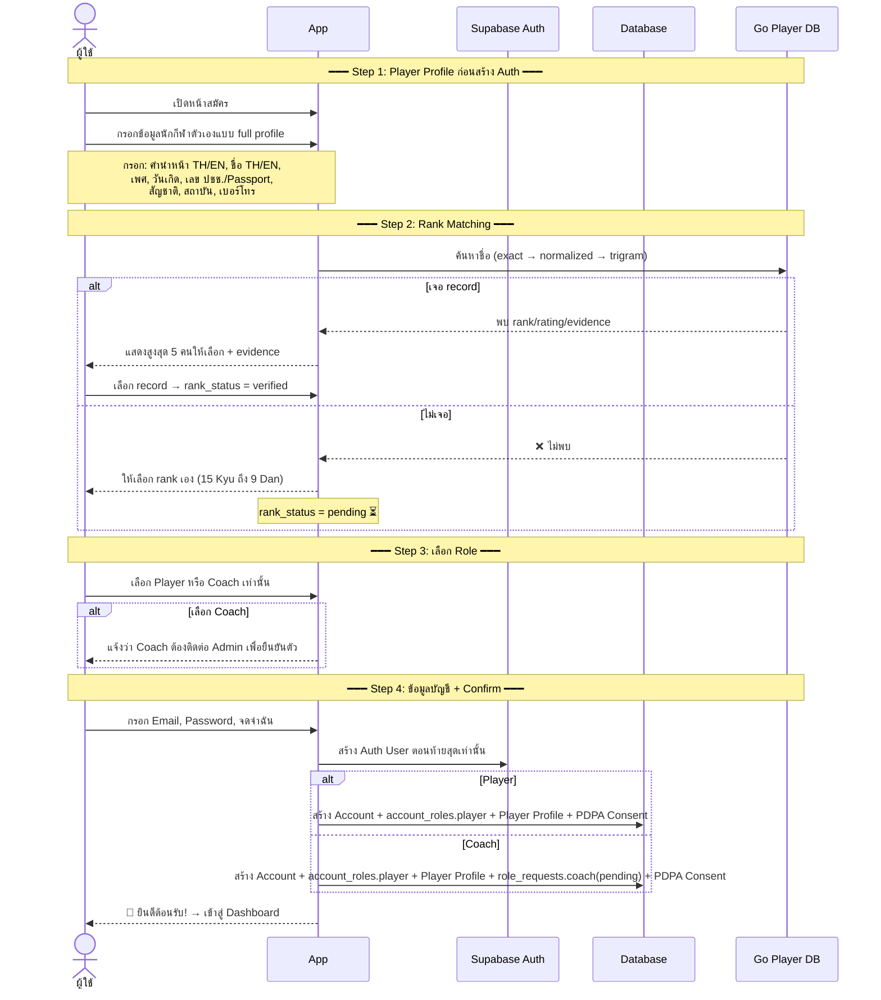
```mermaid
sequenceDiagram
    actor U as ผู้ใช้
    participant App
    participant Auth as Supabase Auth
    participant DB as Database
    participant GoDB as Go Player DB

    Note over U,GoDB: ━━━ Step 1: Player Profile ก่อนสร้าง Auth ━━━
    U->>App: เปิดหน้าสมัคร
    U->>App: กรอกข้อมูลนักกีฬาตัวเองแบบ full profile
    Note over U,App: กรอก: คำนำหน้า TH/EN, ชื่อ TH/EN,<br/>เพศ, วันเกิด, เลข ปชช./Passport,<br/>สัญชาติ, สถาบัน, เบอร์โทร
    Note over U,GoDB: ━━━ Step 2: Rank Matching ━━━
    App->>GoDB: ค้นหาชื่อ (exact → normalized → trigram)
    alt เจอ record
        GoDB-->>App: พบ rank/rating/evidence
        App-->>U: แสดงสูงสุด 5 คนให้เลือก + evidence
        U->>App: เลือก record → rank_status = verified
    else ไม่เจอ
        GoDB-->>App: ❌ ไม่พบ
        App-->>U: ให้เลือก rank เอง (15 Kyu ถึง 9 Dan)
        Note over App: rank_status = pending ⏳
    end
    Note over U,GoDB: ━━━ Step 3: เลือก Role ━━━
    U->>App: เลือก Player หรือ Coach เท่านั้น
    alt เลือก Coach
        App-->>U: แจ้งว่า Coach ต้องติดต่อ Admin เพื่อยืนยันตัว
    end

    Note over U,GoDB: ━━━ Step 4: ข้อมูลบัญชี + Confirm ━━━
    U->>App: กรอก Email, Password, จดจำฉัน
    App->>Auth: สร้าง Auth User ตอนท้ายสุดเท่านั้น
    alt Player
        App->>DB: สร้าง Account + account_roles.player + Player Profile + PDPA Consent
    else Coach
        App->>DB: สร้าง Account + account_roles.player + Player Profile + role_requests.coach(pending) + PDPA Consent
    end
    App-->>U: 🎉 ยินดีต้อนรับ! → เข้าสู่ Dashboard
```

### Flow 1: Coach Role + Coach Link

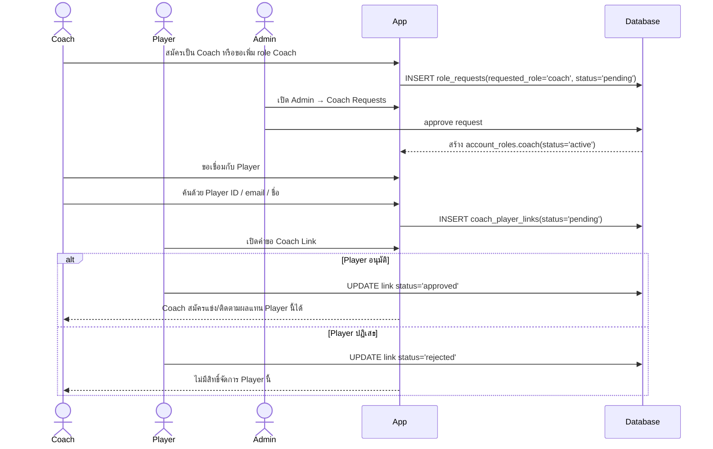
```mermaid
sequenceDiagram
    actor C as Coach
    actor P as Player
    actor A as Admin
    participant App
    participant DB as Database

    C->>App: สมัครเป็น Coach หรือขอเพิ่ม role Coach
    App->>DB: INSERT role_requests(requested_role='coach', status='pending')
    A->>App: เปิด Admin → Coach Requests
    A->>DB: approve request
    DB-->>App: สร้าง account_roles.coach(status='active')

    C->>App: ขอเชื่อมกับ Player
    C->>App: ค้นด้วย Player ID / email / ชื่อ
    App->>DB: INSERT coach_player_links(status='pending')
    P->>App: เปิดคำขอ Coach Link
    alt Player อนุมัติ
        P->>DB: UPDATE link status='approved'
        App-->>C: Coach สมัครแข่ง/ติดตามผลแทน Player นี้ได้
    else Player ปฏิเสธ
        P->>DB: UPDATE link status='rejected'
        App-->>C: ไม่มีสิทธิ์จัดการ Player นี้
    end
```

### Flow 2: Admin Upload Go Player Database

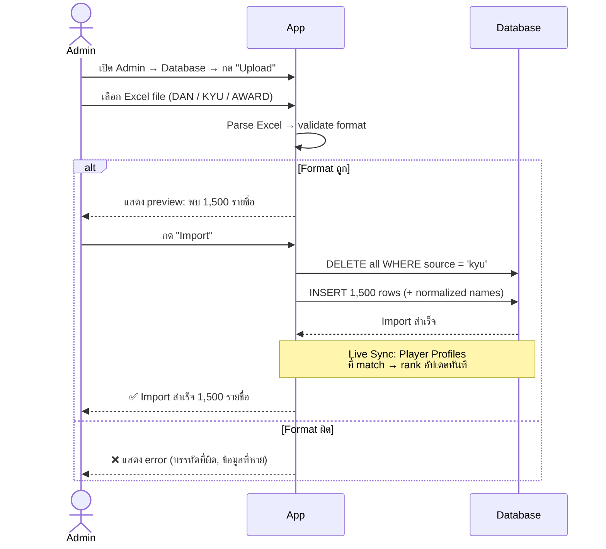
```mermaid
sequenceDiagram
    actor A as Admin
    participant App
    participant DB as Database

    A->>App: เปิด Admin → Database → กด "Upload"
    A->>App: เลือก Excel file (DAN / KYU / AWARD)
    App->>App: Parse Excel → validate format
    alt Format ถูก
        App-->>A: แสดง preview: พบ 1,500 รายชื่อ
        A->>App: กด "Import"
        App->>DB: DELETE all WHERE source = 'kyu'
        App->>DB: INSERT 1,500 rows (+ normalized names)
        DB-->>App: Import สำเร็จ
        Note over App,DB: Live Sync: Player Profiles<br/>ที่ match → rank อัปเดตทันที
        App-->>A: ✅ Import สำเร็จ 1,500 รายชื่อ
    else Format ผิด
        App-->>A: ❌ แสดง error (บรรทัดที่ผิด, ข้อมูลที่หาย)
    end
```

### Flow 2b: Admin Upload Institute Database

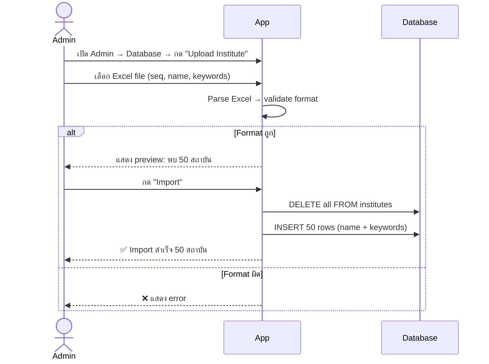
```mermaid
sequenceDiagram
    actor A as Admin
    participant App
    participant DB as Database

    A->>App: เปิด Admin → Database → กด "Upload Institute"
    A->>App: เลือก Excel file (seq, name, keywords)
    App->>App: Parse Excel → validate format
    alt Format ถูก
        App-->>A: แสดง preview: พบ 50 สถาบัน
        A->>App: กด "Import"
        App->>DB: DELETE all FROM institutes
        App->>DB: INSERT 50 rows (name + keywords)
        App-->>A: ✅ Import สำเร็จ 50 สถาบัน
    else Format ผิด
        App-->>A: ❌ แสดง error
    end
```

### Flow 3: Admin สร้าง Tournament

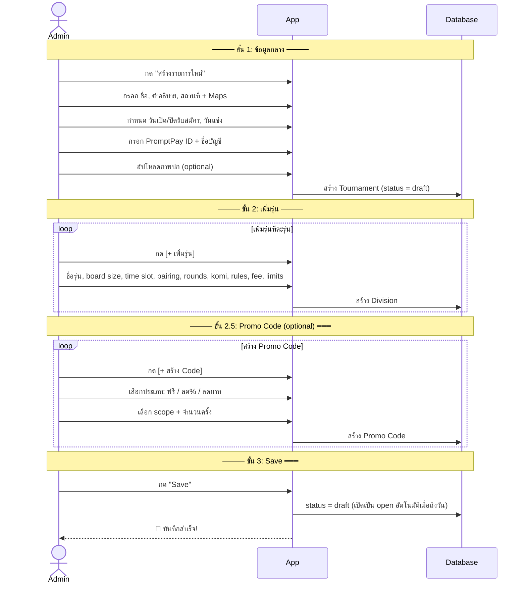
```mermaid
sequenceDiagram
    actor A as Admin
    participant App
    participant DB as Database

    Note over A,DB: ━━━ ขั้น 1: ข้อมูลกลาง ━━━
    A->>App: กด "สร้างรายการใหม่"
    A->>App: กรอก ชื่อ, คำอธิบาย, สถานที่ + Maps
    A->>App: กำหนด วันเปิด/ปิดรับสมัคร, วันแข่ง
    A->>App: กรอก PromptPay ID + ชื่อบัญชี
    A->>App: อัปโหลดภาพปก (optional)
    App->>DB: สร้าง Tournament (status = draft)

    Note over A,DB: ━━━ ขั้น 2: เพิ่มรุ่น ━━━
    loop เพิ่มรุ่นทีละรุ่น
        A->>App: กด [+ เพิ่มรุ่น]
        A->>App: ชื่อรุ่น, board size, time slot, pairing, rounds, komi, rules, fee, limits
        App->>DB: สร้าง Division
    end

    Note over A,DB: ━━━ ขั้น 2.5: Promo Code (optional) ━━━
    loop สร้าง Promo Code
        A->>App: กด [+ สร้าง Code]
        A->>App: เลือกประเภท: ฟรี / ลด% / ลดบาท
        A->>App: เลือก scope + จำนวนครั้ง
        App->>DB: สร้าง Promo Code
    end

    Note over A,DB: ━━━ ขั้น 3: Save ━━━
    A->>App: กด "Save"
    App->>DB: status = draft (เปิดเป็น open อัตโนมัติเมื่อถึงวัน)
    App-->>A: 🎉 บันทึกสำเร็จ!
```

### Flow 5: ผู้เล่นสมัครแข่ง

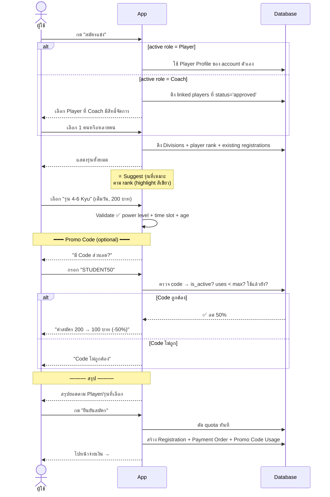
```mermaid
sequenceDiagram
    actor U as ผู้ใช้
    participant App
    participant DB as Database

    U->>App: กด "สมัครแข่ง"
    alt active role = Player
        App->>DB: ใช้ Player Profile ของ account ตัวเอง
    else active role = Coach
        App->>DB: ดึง linked players ที่ status='approved'
        App-->>U: เลือก Player ที่ Coach มีสิทธิ์จัดการ
        U->>App: เลือก 1 คนหรือหลายคน
    end
    App->>DB: ดึง Divisions + player rank + existing registrations
    App-->>U: แสดงรุ่นทั้งหมด
    Note over App: ⭐ Suggest รุ่นที่เหมาะ<br/>ตาม rank (highlight สีเขียว)

    U->>App: เลือก "รุ่น 4-6 Kyu" (เต็มวัน, 200 บาท)
    App->>App: Validate ✅ power level + time slot + age

    Note over U,App: ━━━ Promo Code (optional) ━━━
    App-->>U: "มี Code ส่วนลด?"
    U->>App: กรอก "STUDENT50"
    App->>DB: ตรวจ code → is_active? uses < max? ใช้แล้วยัง?
    alt Code ถูกต้อง
        DB-->>App: ✅ ลด 50%
        App-->>U: "ค่าสมัคร 200 → 100 บาท (-50%)"
    else Code ไม่ถูก
        App-->>U: "Code ไม่ถูกต้อง"
    end

    Note over U,App: ━━━ สรุป ━━━
    App-->>U: สรุปยอดตาม Player/รุ่นที่เลือก
    U->>App: กด "ยืนยันสมัคร"
    App->>DB: ตัด quota ทันที
    App->>DB: สร้าง Registration + Payment Order + Promo Code Usage
    App-->>U: ไปหน้าจ่ายเงิน →
```

### Flow 5b: สมัครรุ่นฟรี

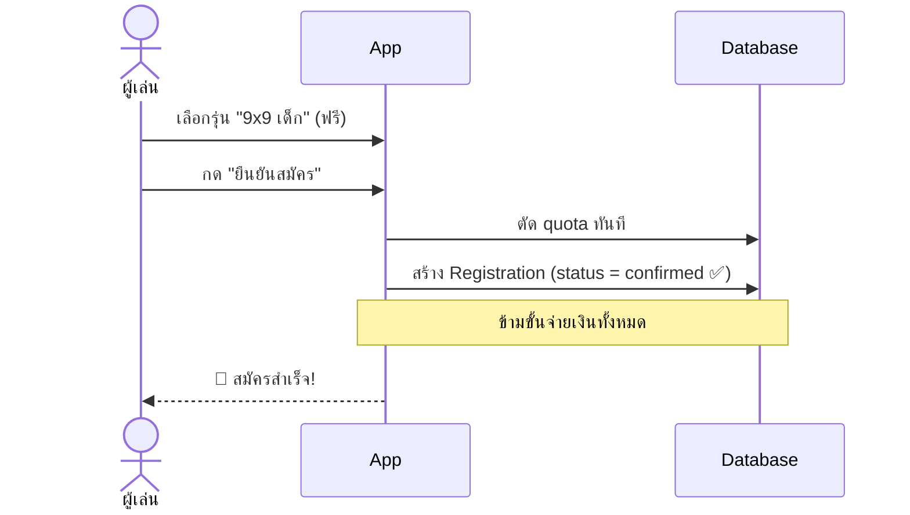
```mermaid
sequenceDiagram
    actor P as ผู้เล่น
    participant App
    participant DB as Database

    P->>App: เลือกรุ่น "9x9 เด็ก" (ฟรี)
    P->>App: กด "ยืนยันสมัคร"
    App->>DB: ตัด quota ทันที
    App->>DB: สร้าง Registration (status = confirmed ✅)
    Note over App,DB: ข้ามขั้นจ่ายเงินทั้งหมด
    App-->>P: 🎉 สมัครสำเร็จ!
```

### Flow 6: จ่ายเงิน (Payment)

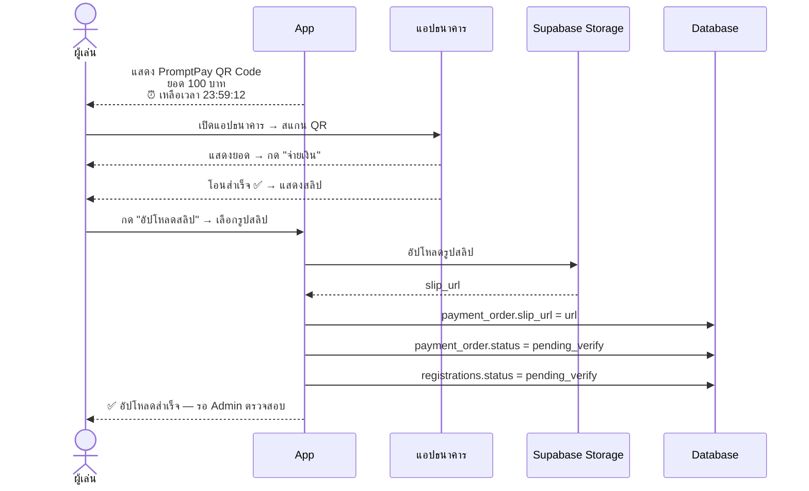
```mermaid
sequenceDiagram
    actor P as ผู้เล่น
    participant App
    participant Bank as แอปธนาคาร
    participant Storage as Supabase Storage
    participant DB as Database

    App-->>P: แสดง PromptPay QR Code<br/>ยอด 100 บาท<br/>⏰ เหลือเวลา 23:59:12
    P->>Bank: เปิดแอปธนาคาร → สแกน QR
    Bank-->>P: แสดงยอด → กด "จ่ายเงิน"
    Bank-->>P: โอนสำเร็จ ✅ → แสดงสลิป

    P->>App: กด "อัปโหลดสลิป" → เลือกรูปสลิป
    App->>Storage: อัปโหลดรูปสลิป
    Storage-->>App: slip_url
    App->>DB: payment_order.slip_url = url
    App->>DB: payment_order.status = pending_verify
    App->>DB: registrations.status = pending_verify
    App-->>P: ✅ อัปโหลดสำเร็จ — รอ Admin ตรวจสอบ
```

### Flow 7: Admin ตรวจสลิป

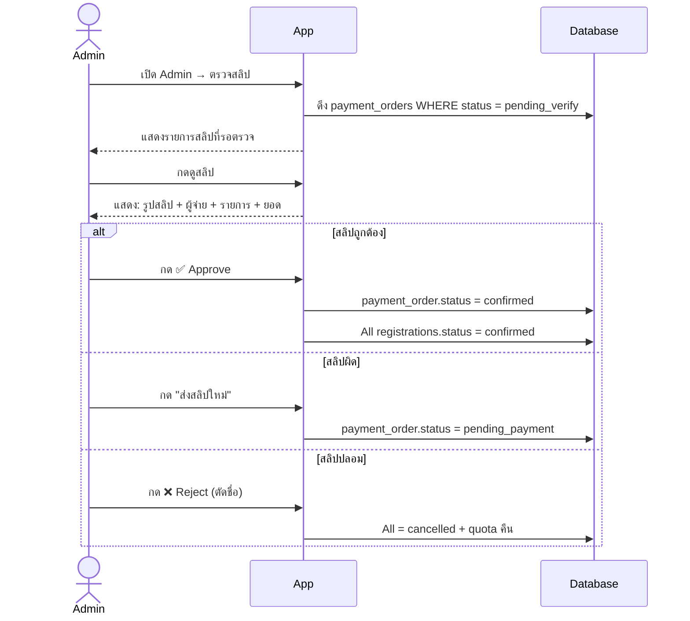
```mermaid
sequenceDiagram
    actor A as Admin
    participant App
    participant DB as Database

    A->>App: เปิด Admin → ตรวจสลิป
    App->>DB: ดึง payment_orders WHERE status = pending_verify
    App-->>A: แสดงรายการสลิปที่รอตรวจ
    A->>App: กดดูสลิป #1
    App-->>A: แสดง: รูปสลิป + ผู้จ่าย + รายการ + ยอด

    alt สลิปถูกต้อง
        A->>App: กด ✅ Approve
        App->>DB: payment_order.status = confirmed
        App->>DB: All registrations.status = confirmed
    else สลิปผิด
        A->>App: กด "ส่งสลิปใหม่"
        App->>DB: payment_order.status = pending_payment
    else สลิปปลอม
        A->>App: กด ❌ Reject (ตัดชื่อ)
        App->>DB: All = cancelled + quota คืน
    end
```

### Flow 8: Admin Approve Pending Ranks

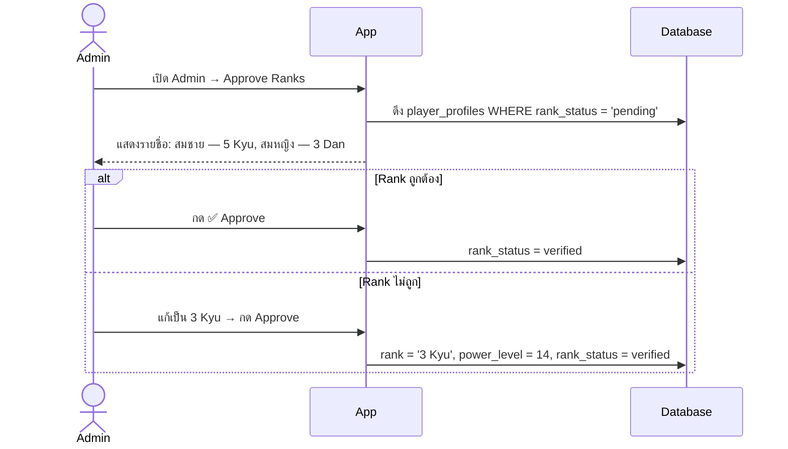
```mermaid
sequenceDiagram
    actor A as Admin
    participant App
    participant DB as Database

    A->>App: เปิด Admin → Approve Ranks
    App->>DB: ดึง player_profiles WHERE rank_status = 'pending'
    App-->>A: แสดงรายชื่อ: สมชาย — 5 Kyu, สมหญิง — 3 Dan
    alt Rank ถูกต้อง
        A->>App: กด ✅ Approve
        App->>DB: rank_status = verified
    else Rank ไม่ถูก
        A->>App: แก้เป็น 3 Kyu → กด Approve
        App->>DB: rank = '3 Kyu', power_level = 14, rank_status = verified
    end
```

### Flow 9: ผู้เล่นยกเลิกสมัคร

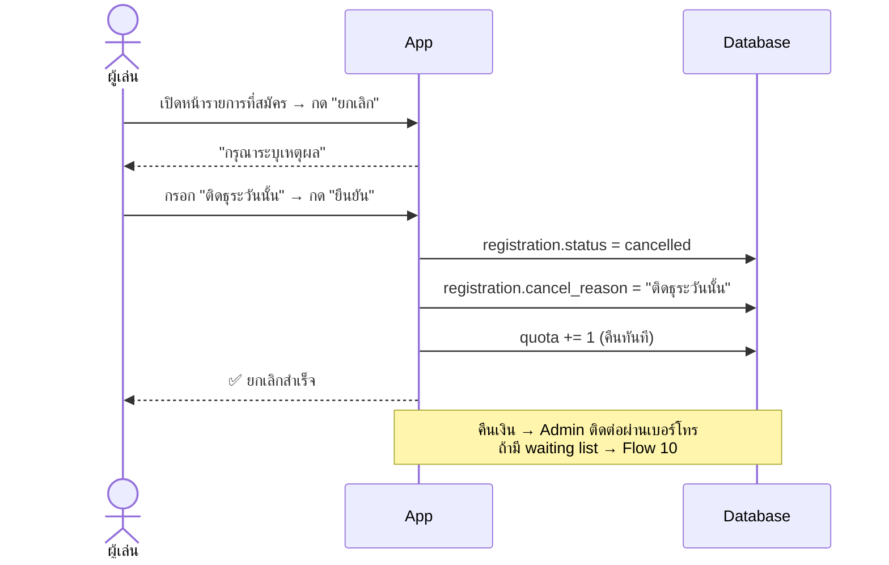
```mermaid
sequenceDiagram
    actor P as ผู้เล่น
    participant App
    participant DB as Database

    P->>App: เปิดหน้ารายการที่สมัคร → กด "ยกเลิก"
    App-->>P: "กรุณาระบุเหตุผล"
    P->>App: กรอก "ติดธุระวันนั้น" → กด "ยืนยัน"
    App->>DB: registration.status = cancelled
    App->>DB: registration.cancel_reason = "ติดธุระวันนั้น"
    App->>DB: quota += 1 (คืนทันที)
    App-->>P: ✅ ยกเลิกสำเร็จ
    Note over App,DB: คืนเงิน → Admin ติดต่อผ่านเบอร์โทร<br/>ถ้ามี waiting list → Flow 10
```

### Flow 10: Waiting List → ได้ที่

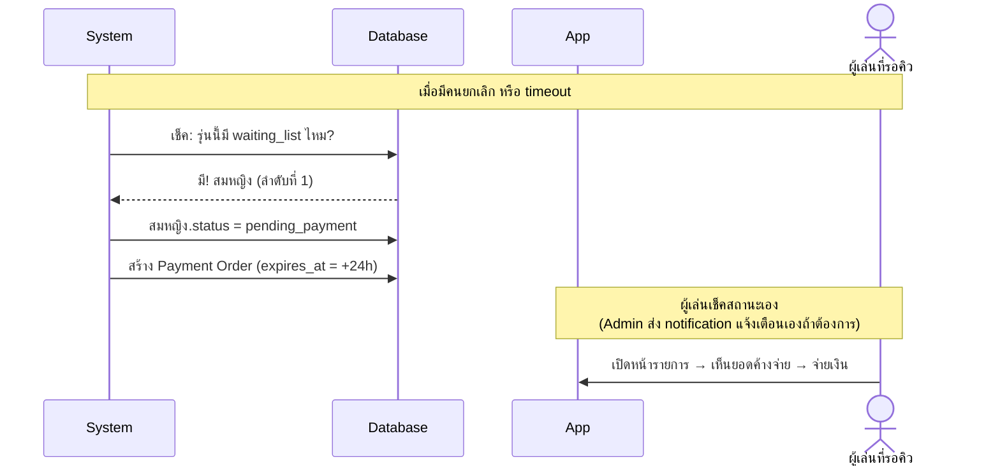
```mermaid
sequenceDiagram
    participant Cron as System
    participant DB as Database
    participant App
    actor W as ผู้เล่นที่รอคิว

    Note over Cron,W: เมื่อมีคนยกเลิก หรือ timeout
    Cron->>DB: เช็ค: รุ่นนี้มี waiting_list ไหม?
    DB-->>Cron: มี! สมหญิง (ลำดับที่ 1)
    Cron->>DB: สมหญิง.status = pending_payment
    Cron->>DB: สร้าง Payment Order (expires_at = +24h)
    Note over W,App: ผู้เล่นเช็คสถานะเอง<br/>(Admin ส่ง notification แจ้งเตือนเองถ้าต้องการ)
    W->>App: เปิดหน้ารายการ → เห็นยอดค้างจ่าย → จ่ายเงิน
```

### Flow 11: Payment Timeout (24 ชม.)

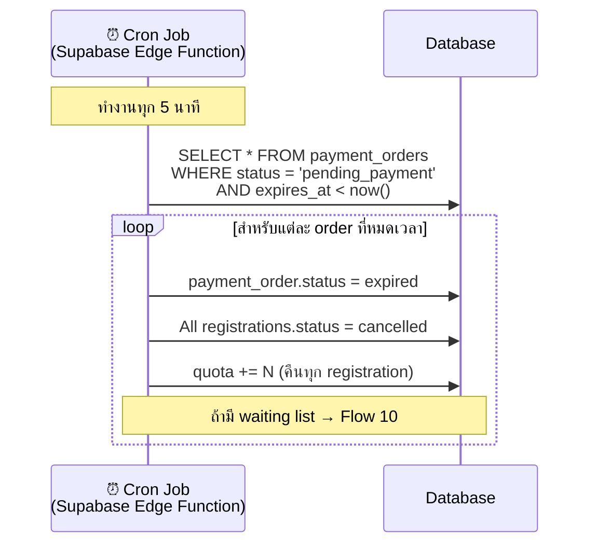
```mermaid
sequenceDiagram
    participant Cron as ⏰ Cron Job<br/>(Supabase Edge Function)
    participant DB as Database

    Note over Cron: ทำงานทุก 5 นาที
    Cron->>DB: SELECT * FROM payment_orders<br/>WHERE status = 'pending_payment'<br/>AND expires_at < now()
    loop สำหรับแต่ละ order ที่หมดเวลา
        Cron->>DB: payment_order.status = expired
        Cron->>DB: All registrations.status = cancelled
        Cron->>DB: quota += N (คืนทุก registration)
        Note over Cron,DB: ถ้ามี waiting list → Flow 10
    end
```

### Flow 12: Notification (Admin Manual Only)

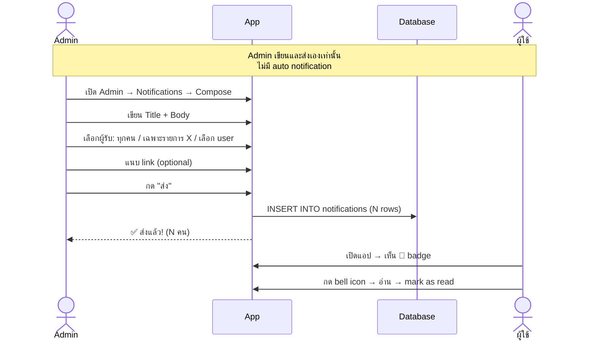
```mermaid
sequenceDiagram
    actor A as Admin
    participant App
    participant DB as Database
    actor U as ผู้ใช้

    Note over A,U: Admin เขียนและส่งเองเท่านั้น<br/>ไม่มี auto notification
    A->>App: เปิด Admin → Notifications → Compose
    A->>App: เขียน Title + Body
    A->>App: เลือกผู้รับ: ทุกคน / เฉพาะรายการ X / เลือก user
    A->>App: แนบ link (optional)
    A->>App: กด "ส่ง"
    App->>DB: INSERT INTO notifications (N rows)
    App-->>A: ✅ ส่งแล้ว! (N คน)
    U->>App: เปิดแอป → เห็น 🔔 badge
    U->>App: กด bell icon → อ่าน → mark as read
```

### Flow 13: ดูสถานะสมัคร (My Registrations)

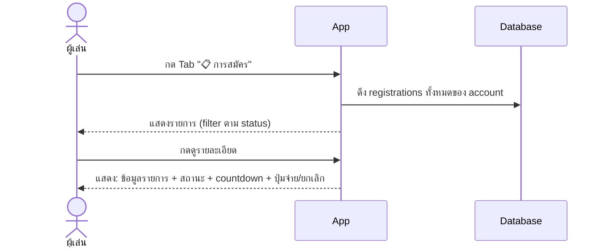
```mermaid
sequenceDiagram
    actor P as ผู้เล่น
    participant App
    participant DB as Database

    P->>App: กด Tab "📋 การสมัคร"
    App->>DB: ดึง registrations ทั้งหมดของ account
    App-->>P: แสดงรายการ (filter ตาม status)
    P->>App: กดดูรายละเอียด
    App-->>P: แสดง: ข้อมูลรายการ + สถานะ + countdown + ปุ่มจ่าย/ยกเลิก
```

### Flow 14: Admin ดูรายชื่อผู้สมัครต่อรุ่น

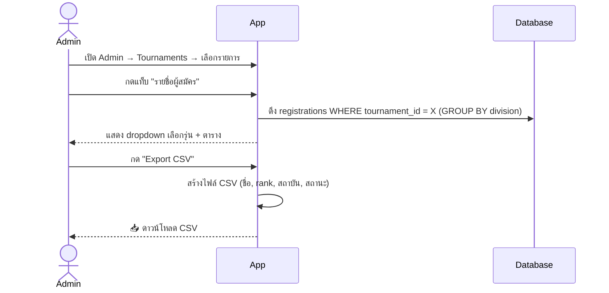
```mermaid
sequenceDiagram
    actor A as Admin
    participant App
    participant DB as Database

    A->>App: เปิด Admin → Tournaments → เลือกรายการ
    A->>App: กดแท็บ "รายชื่อผู้สมัคร"
    App->>DB: ดึง registrations WHERE tournament_id = X (GROUP BY division)
    App-->>A: แสดง dropdown เลือกรุ่น + ตาราง
    A->>App: กด "Export CSV"
    App->>App: สร้างไฟล์ CSV (ชื่อ, rank, สถาบัน, สถานะ)
    App-->>A: 📥 ดาวน์โหลด CSV
```

### Flow Connection Map

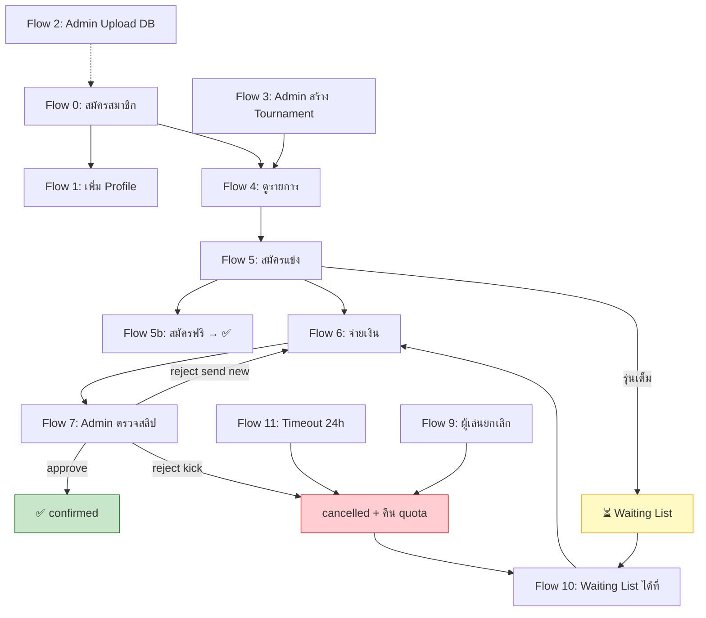
```mermaid
graph TD
    F0["Flow 0: สมัครสมาชิก"] --> F1["Flow 1: เพิ่ม Profile"]
    F2["Flow 2: Admin Upload DB"] -.-> F0
    F3["Flow 3: Admin สร้าง Tournament"]
    F4["Flow 4: ดูรายการ"]
    F0 --> F4
    F3 --> F4
    F4 --> F5["Flow 5: สมัครแข่ง"]
    F5 --> F5b["Flow 5b: สมัครฟรี → ✅"]
    F5 --> F6["Flow 6: จ่ายเงิน"]
    F6 --> F7["Flow 7: Admin ตรวจสลิป"]
    F7 -->|approve| Done["✅ confirmed"]
    F7 -->|reject send new| F6
    F7 -->|reject kick| F9b["cancelled + คืน quota"]
    F5 -->|รุ่นเต็ม| WL["⏳ Waiting List"]
    F11["Flow 11: Timeout 24h"] --> F9b
    F9["Flow 9: ผู้เล่นยกเลิก"] --> F9b
    F9b --> F10["Flow 10: Waiting List ได้ที่"]
    WL --> F10
    F10 --> F6

    style Done fill:#c8e6c9,stroke:#2e7d32
    style F9b fill:#ffcdd2,stroke:#c62828
    style WL fill:#fff9c4,stroke:#f9a825
```

---

## 9. Tournament Day Flows — Phase 2

### ระบบเดิม vs ระบบใหม่

| เรื่อง | TESUJI เดิม | ระบบใหม่ |
|--------|------------|----------|
| Database | Google Sheets | **Supabase (PostgreSQL)** |
| Real-time | SSE | **Supabase Realtime (WebSocket)** |
| Auth กรรมการ | พิมพ์ชื่อ (localStorage) | **Supabase Auth + account_roles.referee จาก invite code** |
| Check-in | per-table (B/W/BOTH) | **per-table + อัปเดต registrations.status** |
| Schedule | Hardcoded 4 templates | **Admin สร้าง template ใน DB** |
| UI | 3 HTML pages แยก | **Next.js pages ใน app shell** |
| Deploy | Render.com | **Vercel + Supabase** |

### Tournament Day Timeline

```mermaid
graph LR
    A["☀️ Admin กด 'เริ่มแข่ง'<br/>status = in_progress"] --> B["📥 Import จับคู่รอบ 1<br/>(TSV จาก MacMahon)"]
    B --> C["📋 กรรมการเปิดหน้า Judge"]
    C --> D["✅ Check-in ต่อโต๊ะ"]
    D --> E["♟️ แข่งรอบที่ N"]
    E --> F["📝 กรรมการบันทึกผล"]
    F --> G{"ยังมีรอบ?"}
    G -->|ใช่| H["📥 Import จับคู่รอบถัดไป"]
    H --> D
    G -->|ไม่| I["📥 Import Standings"]
    I --> J["🏆 Admin กด 'จบรายการ'<br/>status = completed"]
```

### Check-in Flow

```mermaid
sequenceDiagram
    actor R as กรรมการ (account_roles.referee)
    participant App as Next.js App
    participant DB as Supabase

    R->>App: Login → เปิดหน้า Judge
    App->>DB: SELECT matches WHERE round_id = X
    DB-->>App: matches + player names
    R->>App: กดโต๊ะ 3 → "ดำมาแล้ว"
    App->>DB: UPDATE matches SET checkin = 'B' WHERE id = Y
    App->>DB: UPDATE registrations SET status = 'checked_in'
    Note over DB: Supabase Realtime broadcast<br/>→ ทุก client เห็นทันที
    R->>App: กด "ขาวมาแล้ว"
    App->>DB: UPDATE matches SET checkin = 'BOTH'
    App-->>R: โต๊ะ 3: ⚫ ✅ | ⚪ ✅ → พร้อมแข่ง!
```

### TSV Import + Name Matching Flow

```mermaid
sequenceDiagram
    actor A as Admin
    participant App as Next.js App
    participant DB as Supabase

    A->>App: Drag-and-Drop TSV file จาก MacMahon
    App->>App: parseMacMahon(tsv)
    alt Pairing file
        App->>DB: ดึง player_profiles ทั้งรุ่น
        App->>App: Name matching:<br/>1. exact match ชื่อ TH/EN<br/>2. normalized<br/>3. fuzzy → แสดงให้ Admin เลือก
        App-->>A: Preview:<br/>✅ สมชาย → matched<br/>⚠️ "John Smith" → ไม่เจอ (เลือก manual)
        A->>App: Map → กด Import
        App->>DB: INSERT rounds + matches
        Note over DB: Supabase Realtime → broadcast
    else Standings file
        App-->>A: Preview: ตารางอันดับ
        A->>App: กด Import
        App->>DB: UPSERT standings (JSONB)
    end
```

### Force Pairing Flow

```mermaid
sequenceDiagram
    actor R as กรรมการ/Admin
    participant App as Next.js App
    participant DB as Supabase

    R->>App: เปิดโต๊ะ 5 → กด "Force Pairing"
    App->>DB: ดึงรายชื่อผู้เล่นทั้งรุ่น
    App-->>R: Dropdown ชื่อ + ช่องพิมพ์อิสระ
    R->>App: ⚫ = "สมปอง" / ⚪ = "สมชาย"
    App->>DB: UPDATE matches SET force_black_name, force_white_name
    Note over App: Conflict detection:<br/>"สมปอง" อยู่โต๊ะ 8 ด้วย<br/>→ UPDATE matches[8] SET remark = 'ไม่มีผู้เข้าแข่งขัน'
```

### Result Submission — 2 ขั้นยืนยัน

```mermaid
sequenceDiagram
    actor R as กรรมการ
    participant App as Next.js App
    participant DB as Supabase

    R->>App: กดโต๊ะ 3
    App-->>R: Modal: ⚫ สมชาย vs ⚪ สมหญิง
    R->>App: กด "⚫ ดำชนะ"
    App-->>R: ยืนยัน? "โต๊ะ 3: ⚫ สมชาย ชนะ"
    R->>App: กด "✅ ยืนยัน"
    App->>DB: UPDATE matches SET result='1-0',<br/>submitted_by=referee_id, submitted_at=now()
    Note over DB: Supabase Realtime → broadcast<br/>ผู้ชมเห็นผลทันที
    App-->>R: ✅ บันทึกสำเร็จ → โต๊ะ 3 = 🟢
```

### Realtime Channels

```typescript
// ผู้ชมหน้า Results — subscribe ต่อ tournament
const matchChannel = supabase
  .channel(`tournament:${tournamentId}:matches`)
  .on('postgres_changes', {
    event: '*',
    schema: 'public',
    table: 'matches',
    filter: `round_id=in.(${roundIds.join(',')})`,
  }, handleMatchUpdate)
  .subscribe()

// Standings
const standingsChannel = supabase
  .channel(`tournament:${tournamentId}:standings`)
  .on('postgres_changes', {
    event: '*',
    schema: 'public',
    table: 'standings',
    filter: `division_id=in.(${divisionIds.join(',')})`,
  }, handleStandingsUpdate)
  .subscribe()

// Announcements (broadcast channel)
const announceChannel = supabase
  .channel(`tournament:${tournamentId}:announce`)
  .on('broadcast', { event: 'announcement' }, handleAnnouncement)
  .subscribe()
```

### Admin Tournament Day Controls

| # | Feature |
|:-:|---------|
| 1 | เริ่ม/จบรายการ — ปุ่ม "เริ่มแข่ง" / "จบรายการ" |
| 2 | Import pairing TSV — Drag-and-Drop |
| 3 | Import standings TSV — Drag-and-Drop |
| 4 | Overview per division — Progress bar ต่อรุ่น |
| 5 | ลบรอบ — ลบ matches ทั้งรอบ + re-import |
| 6 | Announcements — พิมพ์ + broadcast (max 300 chars) |
| 7 | Schedule — สร้าง template + map ให้รุ่น |
| 8 | Force Pairing — Override ทีละโต๊ะ |

---

## 10. State Machines

### Registration Status

```mermaid
stateDiagram-v2
    [*] --> pending_payment: สมัคร (quota -1)
    [*] --> confirmed: สมัคร (ฟรี / code ฟรี)
    [*] --> waiting_list: รุ่นเต็ม

    pending_payment --> pending_verify: อัปโหลดสลิป
    pending_payment --> expired: หมดเวลา 24 ชม.
    pending_payment --> cancelled: ผู้เล่นยกเลิก

    pending_verify --> confirmed: Admin approve ✅
    pending_verify --> pending_payment: Admin → ส่งสลิปใหม่
    pending_verify --> cancelled: Admin reject ❌

    waiting_list --> pending_payment: ได้ที่! (เริ่ม 24 ชม.)
    waiting_list --> cancelled: ผู้เล่นยกเลิก

    confirmed --> checked_in: เช็กชื่อวันแข่ง (Phase 2)
    confirmed --> cancelled: ผู้เล่นยกเลิก

    expired --> [*]: quota คืน ♻️
    cancelled --> [*]: quota คืน ♻️
```

### Payment Order Status

```mermaid
stateDiagram-v2
    [*] --> pending_payment: สร้าง order (เริ่มนับ 24 ชม.)
    pending_payment --> pending_verify: อัปโหลดสลิป
    pending_payment --> expired: ⏰ หมดเวลา
    pending_payment --> cancelled: ผู้เล่นยกเลิก
    pending_verify --> confirmed: Admin approve ✅
    pending_verify --> pending_payment: Admin → ส่งใหม่
    pending_verify --> cancelled: Admin reject ❌
```

### Tournament Status

```mermaid
stateDiagram-v2
    [*] --> draft: Admin สร้าง
    draft --> open: เปิดรับสมัคร (auto/manual)
    open --> closed: ปิดรับสมัคร (auto/manual)
    closed --> in_progress: Admin กด "เริ่มแข่ง"
    in_progress --> completed: Admin กด "จบรายการ"
    draft --> cancelled: Admin ยกเลิก
    open --> cancelled: Admin ยกเลิก
    closed --> cancelled: Admin ยกเลิก
```

### Match Result (Phase 2)

```mermaid
stateDiagram-v2
    [*] --> pending: Import pairing (?-?)
    pending --> black_win: กรรมการกด "ดำชนะ" (1-0)
    pending --> white_win: กรรมการกด "ขาวชนะ" (0-1)
    black_win --> pending: ยกเลิกผล
    white_win --> pending: ยกเลิกผล
```

### Check-in (Phase 2)

```mermaid
stateDiagram-v2
    [*] --> none: Match created
    none --> B: ดำมาแล้ว
    none --> W: ขาวมาแล้ว
    B --> BOTH: ขาวมาแล้ว
    W --> BOTH: ดำมาแล้ว
    B --> none: ยกเลิก
    W --> none: ยกเลิก
    BOTH --> B: ยกเลิกขาว
    BOTH --> W: ยกเลิกดำ
```

---

## 11. Pages & UI Specs

### App Shell

**Header** (fixed top, 56px, transparent):
```
╭──────────────────────────────────────╮
│  [Logo 32px]  ชื่อระบบ        🔔 (3) │
╰──────────────────────────────────────╯
```

**Bottom Navigation** (fixed bottom, 64px, glass — ไม่แสดงใน Admin/Login/Register):
```
╭──────────────────────────────────────╮
│  🏠      🏆      📋      👤      ☰   │
│ หน้าแรก  รายการ  สมัคร  โปรไฟล์ เพิ่ม │
╰──────────────────────────────────────╯
```

### หน้า Login (`/login`)

```
╭──────────────────────────────────────╮  ← Pastel gradient background
│            ╭────────╮                │
│            │ [Logo] │                │  ← 64×64
│            ╰────────╯                │
│       ยินดีต้อนรับกลับ ✨              │
│    เข้าสู่ระบบสมัครแข่งหมากล้อม       │
│  ╭────────────────────────────────╮  │  ← Glass Card
│  │  อีเมล                        │  │
│  │  ┌────────────────────────┐   │  │
│  │  │  email@example.com     │   │  │
│  │  └────────────────────────┘   │  │
│  │  รหัสผ่าน                     │  │
│  │  ┌────────────────────────┐   │  │
│  │  │  ••••••••           👁  │   │  │
│  │  └────────────────────────┘   │  │
│  │  ☐ จำฉันไว้     ลืมรหัสผ่าน?   │  │
│  │  ╭────────────────────────╮   │  │  ← Gradient button
│  │  │     เข้าสู่ระบบ →      │   │  │
│  │  ╰────────────────────────╯   │  │
│  │    ยังไม่มีบัญชี? สมัครสมาชิก   │  │
│  ╰────────────────────────────────╯  │
╰──────────────────────────────────────╯
```

### หน้า Register (`/register`) — Multi-step

```
╭──────────────────────────────────────╮
│  ← กลับ          สมัครสมาชิก         │
│  [1•]───[2]───[3]───[4]───[5]       │  ← Step indicator
│  ╭────────────────────────────────╮  │  ← Glass Card
│  │  Step 1: Email + Password      │  │
│  │  Step 2: เลือก Player/Coach    │  │
│  │  Step 3: Player Info/Coach Req │  │
│  │  Step 4: Rank Matching(Player) │  │
│  │  Step 5: PDPA Consent          │  │
│  │  ╭────────────────────────╮   │  │
│  │  │      ถัดไป →           │   │  │
│  │  ╰────────────────────────╯   │  │
│  ╰────────────────────────────────╯  │
╰──────────────────────────────────────╯
```

### Landing Page — Public (ไม่ login)

```
╭──────────────────────────────────────╮
│            ╭────────╮                │
│            │ [Logo] │                │
│            ╰────────╯                │
│      ระบบสมัครแข่งหมากล้อม           │
│      Go Tournament Manager           │
│  ╭────────────────────────────────╮  │  ← Gradient CTA
│  │        🔑 เข้าสู่ระบบ →        │  │
│  ╰────────────────────────────────╯  │
│  ╭────────────────────────────────╮  │  ← Outline CTA
│  │        📝 สมัครสมาชิก          │  │
│  ╰────────────────────────────────╯  │
│  ── รายการที่กำลังเปิดรับสมัคร ──    │
│  ╭────────────────────────────────╮  │  ← Glass Card
│  │  🏆 หมากล้อมชิงแชมป์ 2569     │  │
│  │  📅 15 ก.ค. 69  📍 กรุงเทพ    │  │
│  │  ██████████░░  45/100 คน      │  │  ← Progress bar
│  ╰────────────────────────────────╯  │
╰──────────────────────────────────────╯
```

### Landing Page — Authenticated (Digital ID Card)

```
╭────────────────────────────────────╮  ← Glass Card
│  ╭────────╮                        │
│  │        │    สมชาย ใจดี          │
│  │ QR Code│    Somchai Jaidee      │
│  │        │                        │
│  ╰────────╯    🏅 3 Dan  ✅        │
│  🏢 Buddy GO     👤 นักกีฬา        │
│  ────────── กดเพื่อขยาย QR ──────── │
╰────────────────────────────────────╯
```

Quick Access 2×2 Grid (เปลี่ยนตาม role):
```
╭───────────╮ ╭───────────╮
│   🏆      │ │   📝      │
│ ดูรายการ   │ │ สมัครแข่ง  │
╰───────────╯ ╰───────────╯
╭───────────╮ ╭───────────╮
│   📋      │ │   🏅      │
│ การสมัคร   │ │ ระดับฝีมือ │
╰───────────╯ ╰───────────╯
```

### หน้า Tournament List (`/tournaments`)

```
╭──────────────────────────────────────╮
│  [ทั้งหมด•] [เปิดรับ] [ปิด] [จบแล้ว]│  ← Filter pills
│  ╭────────────────────────────────╮  │  ← Glass Card
│  │  [Banner Image]                │  │
│  │  🏆 หมากล้อมชิงแชมป์ 2569     │  │
│  │  📅 15 ก.ค.  📍 กรุงเทพ       │  │
│  │  🏟️ 3 รุ่น   👥 45/100 คน    │  │
│  │  ╭──────╮                     │  │
│  │  │ เปิดรับ │                     │  │  ← Status badge
│  │  ╰──────╯                     │  │
│  ╰────────────────────────────────╯  │
╰──────────────────────────────────────╯
```

### หน้า Tournament Detail (`/tournaments/[id]`)

```
╭──────────────────────────────────────╮
│  ← กลับ                    แชร์ 📤  │
│  [Banner Image]                      │
│  🏆 หมากล้อมชิงแชมป์ 2569           │
│  ╭──────╮                           │
│  │ เปิดรับ │                           │
│  ╰──────╯                           │
│  📅 15 ก.ค. 2569  📍 กรุงเทพ         │
│  ── รุ่นการแข่ง ──                    │
│  ╭────────────────────────────────╮  │
│  │  🎯 1-12 Kyu 19x19            │  │
│  │  ⏰ เช้า  💰 200 บาท          │  │
│  │  👥 20/30  ████████░░░         │  │
│  ╰────────────────────────────────╯  │
│  ╭────────────────────────────────╮  │  ← Sticky CTA
│  │      📝 สมัครแข่งขัน →         │  │
│  ╰────────────────────────────────╯  │
╰──────────────────────────────────────╯
```

### หน้า My Registrations (`/my-registrations`)

```
╭──────────────────────────────────────╮
│  การสมัครของฉัน                      │
│  [ทั้งหมด•] [รอจ่าย] [ยืนยัน] [อื่นๆ]│
│  ╭────────────────────────────────╮  │
│  │  ── สมชาย ใจดี ──              │  │
│  │  🏆 หมากล้อมชิงแชมป์ 2569     │  │
│  │  🎯 1-12 Kyu 19x19            │  │
│  │  │ 🟢 ยืนยันแล้ว │                  │  │
│  ╰────────────────────────────────╯  │
│  ╭────────────────────────────────╮  │
│  │  ── สมหญิง ใจดี (linked) ──    │  │
│  │  🎯 9-15 Kyu 9x9              │  │
│  │  │ 🟡 รอจ่ายเงิน │                  │  │
│  │  ⏰ เหลือ 23:45:00            │  │
│  │  │ 💳 จ่ายเงิน │                  │  │
│  ╰────────────────────────────────╯  │
╰──────────────────────────────────────╯
```

### หน้า Profile (`/profile`)

```
╭──────────────────────────────────────╮
│  โปรไฟล์ / Coach Links              │
│  ╭────────────────────────────────╮  │
│  │  สมชาย ใจดี                    │  │
│  │  Somchai Jaidee                │  │
│  │  🏅 3 Dan  ✅ verified         │  │
│  │  🏢 Buddy GO                   │  │
│  │  📅 17 พ.ค. 2548 (19 ปี)      │  │
│  │  │ ✏️ แก้ไข  │                  │  │
│  ╰────────────────────────────────╯  │
│  ── Coach Links ──                   │
│  ╭────────────────────────────────╮  │
│  │  Coach A ขอเชื่อม  [อนุมัติ] [ปฏิเสธ] │
│  ╰────────────────────────────────╯  │
╰──────────────────────────────────────╯
```

### Admin Dashboard (`/admin`) — Desktop

```
┌──────────────────────────────────────────────────────────┐
│  ╭── Sidebar 240px ──╮  ╭── Main Content ─────────────╮ │
│  │  [Logo] TESUJI    │  │  📊 ภาพรวม                   │ │
│  │                    │  │                              │ │
│  │  📊 หน้าหลัก   •  │  │  ╭──────╮ ╭──────╮ ╭──────╮ │ │
│  │  🏆 รายการแข่ง    │  │  │ 💳 5  │ │ ⏳ 12 │ │ 🏆 3  │ │ │
│  │  💳 ตรวจสลิป      │  │  │ สลิป  │ │ Rank │ │รายการ │ │ │
│  │  ⏳ อนุมัติ Rank   │  │  │ รอ    │ │ รอ   │ │เปิด   │ │ │
│  │  👥 ผู้ใช้         │  │  ╰──────╯ ╰──────╯ ╰──────╯ │ │
│  │                    │  │                              │ │
│  │  📂 Go Player DB  │  │  ── 🏆 รายการ ──             │ │
│  │  🏢 สถาบัน        │  │  [Tournament Cards Grid]     │ │
│  │  🔔 ส่งประกาศ     │  │                              │ │
│  │                    │  │                              │ │
│  │  👤 Admin         │  │                              │ │
│  │  ⚙ ออกจากระบบ    │  │                              │ │
│  ╰────────────────────╯  ╰──────────────────────────────╯ │
└──────────────────────────────────────────────────────────┘
```

### Judge Page (`/tournaments/[id]/judge`) — Phase 2

```
┌──────────────────────────────────────┐
│  [Logo]  หน้ากรรมการ          🔔     │
├──────────────────────────────────────┤
│  รุ่น: [1-12 Kyu 19x19 ▼]           │
│  รอบ: [3]  ⏰ เหลือ 24:15           │
├──────────────────────────────────────┤
│  [📊 ผล] [✅ เช็กชื่อ] [🔀 Force]    │  ← Tab bar
├──────────────────────────────────────┤
│  ┌──┐ ┌──┐ ┌──┐ ┌──┐ ┌──┐ ┌──┐     │
│  │🟢│ │🟢│ │🟡│ │🟡│ │🟢│ │🟡│     │
│  │ 1│ │ 2│ │ 3│ │ 4│ │ 5│ │ 6│     │
│  └──┘ └──┘ └──┘ └──┘ └──┘ └──┘     │
│  🟢 = ส่งผลแล้ว (4/6)               │
│  🟡 = รอผล                          │
│  กดเลือกโต๊ะ → Modal บันทึกผล       │
├──────────────────────────────────────┤
│  🏠   🏆   📋   👤   ☰              │
└──────────────────────────────────────┘
```

### Live Results Page (`/tournaments/[id]/live`) — Phase 2

```
┌──────────────────────────────────────┐
│  [Logo]  ชื่อรายการ           🔔     │
├──────────────────────────────────────┤
│  📅 15 มี.ค. 2569 | 📍 กรุงเทพ      │
│  ⏰ รอบ 3 กำลังแข่ง — เหลือ 24:15   │
├──────────────────────────────────────┤
│  ── My Status ──                     │
│  ┌────────────────────────────────┐  │
│  │ ⚫ สมชาย ใจดี (5 Dan)         │  │
│  │ รอบ 3: ✅ ชนะ                 │  │
│  │ ถัดไป: vs สมหญิง | โต๊ะ 5 | ⚪ │  │
│  └────────────────────────────────┘  │
│  [+ ติดตามผู้เล่น]                   │
├──────────────────────────────────────┤
│  [1-12 Kyu 19x19•] [9-15 Kyu 9x9]  │
│  รอบ: [1] [2] [3•] [4] [5]         │
│  ┌─────┬──────────┬──────────┬────┐ │
│  │โต๊ะ │ ⚫ ดำ     │ ⚪ ขาว   │ ผล │ │
│  ├─────┼──────────┼──────────┼────┤ │
│  │  1  │ สมชาย    │ สมหญิง   │1-0 │ │
│  │  2  │ สมศักดิ์  │ สมปอง    │🟡  │ │
│  │  3  │ สมใจ     │ สมพร     │0-1 │ │
│  └─────┴──────────┴──────────┴────┘ │
│  ── ตารางอันดับ ──                    │
│  🥇 สมชาย ใจดี      5 แต้ม          │
│  🥈 สมหญิง ใจดี     4 แต้ม          │
│  🥉 สมศักดิ์ ดีมาก   3.5 แต้ม        │
└──────────────────────────────────────┘
```

### Admin Tournament Day (`/admin/tournaments/[id]/day`) — Phase 2

```
┌──────────────────────────────────────┐
│  [Logo]  Admin — วันแข่ง      🔔     │
├──────────────────────────────────────┤
│  📢 ประกาศ: [________________] [ส่ง] │
│  ── รุ่น 1: 1-12 Kyu 19x19 ──       │
│  รอบ 3 | ส่งผลแล้ว 4/6 (67%)        │
│  ████████████░░░░░░                  │
│  [ดูรายละเอียด] [Import รอบ 4]       │
│  ── รุ่น 2: 9-15 Kyu 9x9 ──         │
│  รอบ 5 | ส่งผลแล้ว 8/8 (100%) ✅    │
│  [Import Standings]                  │
│  ── Import ──                        │
│  ┌────────────────────────────────┐  │
│  │  📄 ลาก TSV file มาวางที่นี่    │  │
│  │     หรือ [เลือกไฟล์]           │  │
│  └────────────────────────────────┘  │
└──────────────────────────────────────┘
```

### Key UI Components

**Date Picker — Buddhist Year:**
```
╭──────────────────────────────╮
│  วัน        เดือน       ปี    │
│ ┌──────┐  ┌───────┐  ┌─────┐ │
│ │  15  │  │ มี.ค. │  │2548 │ │
│ │ [17] │  │[พ.ค.] │  │[2550]│ │  ← Selected
│ │  19  │  │ ก.ค.  │  │2552 │ │
│ └──────┘  └───────┘  └─────┘ │
│  อายุ: 19 ปี                  │  ← Auto-calculated
╰──────────────────────────────╯
```

**Status Badges:**
```
╭──────────╮  ╭──────────╮  ╭──────────╮
│ 🟢 ยืนยัน │  │ 🟡 รอจ่าย │  │ 🟠 รอตรวจ │
╰──────────╯  ╰──────────╯  ╰──────────╯
╭──────────╮  ╭──────────╮  ╭──────────╮
│ 🔵 รอคิว  │  │ 🔴 ยกเลิก │  │ ⚪ แบบร่าง │
╰──────────╯  ╰──────────╯  ╰──────────╯
```

---

## 12. Sitemap

### User Pages (Mobile-Only) — 17 pages

```
/                           → Home (public landing / Digital ID + Quick Access)
/login                      → Login (full-screen, no shell)
/register                   → Register (multi-step, full-screen)
/forgot-password            → Forgot Password (Supabase)
/tournaments                → Tournament List (filter)
/tournaments/[id]           → Tournament Detail
/tournaments/[id]/register  → Player/Coach Linked Player Division Selection + Promo + Payment
/tournaments/[id]/live      → Live Results (public, real-time) ← Phase 2
/tournaments/[id]/judge     → Judge Page (referee only) ← Phase 2
/my-registrations           → My Registrations
/my-registrations/[id]      → Registration Detail + Payment Status
/profile                    → My Player Profile / Coach Links
/profile/[id]               → View/Edit own Player Profile
/coach/requests             → Coach role request + link requests
/referee/invite             → Redeem referee invite code
/notifications              → Notification List
/settings                   → Settings (language, logout)
/privacy                    → Privacy Policy (PDPA)
```

### Admin Pages (Desktop-Only) — 11 pages

```
/admin                                  → Admin Dashboard
/admin/tournaments                      → Manage Tournaments
/admin/tournaments/new                  → Create Tournament (3 steps)
/admin/tournaments/[id]                 → Edit Tournament + Divisions + Promo Codes
/admin/tournaments/[id]/registrations   → รายชื่อผู้สมัครต่อรุ่น + Export CSV
/admin/tournaments/[id]/day             → Tournament Day Controls ← Phase 2
/admin/payments                         → Verify Payments
/admin/ranks                            → Approve Pending Ranks
/admin/users                            → User Management
/admin/roles                            → Coach approvals + Referee invite codes
/admin/database                         → Upload Go Player DB + Institute DB
/admin/notifications                    → Compose & Send Notifications
```

**Total: 28 pages**

---

## 13. Acceptance Criteria

### AC1: Register + Login

- [ ] User สมัครด้วย email + password + phone (รหัสประเทศ)
- [ ] Email: unique
- [ ] Password: min 8 chars + "จำฉันไว้" checkbox
- [ ] ตอนสมัครเลือกได้เฉพาะ Player หรือ Coach
- [ ] Player ต้องกรอกข้อมูลนักกีฬาตัวเอง (TH + EN names, gender, DOB, national ID/passport, institute)
- [ ] Player: National ID / Passport → SHA-256 hash → check unique → ถ้าซ้ำ show hint 3 ตัว
- [ ] Player: Rank matching exact → normalized → trigram (สูงสุด 5 คน)
- [ ] Player: ไม่เจอ → กรอก rank เอง → pending
- [ ] Coach: สร้าง Player Profile ของตัวเอง, ได้ `account_roles.player`, และสร้าง `role_requests.coach` เป็น pending
- [ ] Referee สมัครตรงไม่ได้ ต้องใช้ invite code จาก Admin เท่านั้น
- [ ] PDPA consent checkbox required
- [ ] Login ด้วย **email + password** เท่านั้น
- [ ] Forgot password → Supabase reset email

### AC2: Player Profile

- [ ] Player ดูโปรไฟล์ตัวเองได้ 1 profile ต่อ account
- [ ] แก้ไขได้: phone, email
- [ ] แก้ไขไม่ได้: ชื่อ, นามสกุล, วันเกิด, เลข ปชช.
- [ ] สลับ active role ได้เฉพาะ role ที่ได้รับอนุมัติแล้ว
- [ ] เพิ่ม profile ใหม่เองไม่ได้ และ Coach สร้าง profile ให้ Player ไม่ได้
- [ ] ลบ profile ไม่ได้
- [ ] แสดง rank + rank_status (verified ✅ / pending ⏳)

### AC2.1: Coach Role + Coach Link

- [ ] Coach signup/request role แล้ว status = pending จน Admin approve
- [ ] Admin approve/reject Coach request ได้
- [ ] Coach ค้นหา Player ที่มีบัญชีอยู่แล้วและส่ง link request ได้
- [ ] Player approve/reject Coach Link ได้เอง
- [ ] Coach เห็น/สมัคร/ติดตามผลได้เฉพาะ linked players ที่ status = approved
- [ ] Coach revoke link ได้ และ Player revoke link ได้
- [ ] Admin เห็น relationship ทั้งหมดเพื่อ audit ได้

### AC2.2: Referee Invite

- [ ] Admin สร้าง invite code สำหรับ Referee ได้
- [ ] User redeem code ได้ครั้งเดียวก่อนหมดอายุ
- [ ] Redeem สำเร็จแล้วสร้าง `account_roles.referee`
- [ ] Code ที่ใช้แล้ว/หมดอายุ/ถูก revoke ใช้ซ้ำไม่ได้

### AC3: Admin Create Tournament

- [ ] ขั้น 1: กรอกข้อมูลกลาง (ชื่อ, สถานที่, วันเวลา, PromptPay, ภาพปก)
- [ ] ขั้น 2: เพิ่มรุ่นทีละรุ่น
- [ ] ขั้น 3: ตรวจสอบ → เปิดรับสมัคร (draft → open auto ตามวัน)
- [ ] ปิดรับสมัคร auto ตามวัน (Admin ปิดก่อนได้)
- [ ] แก้ไขรายการหลัง open ได้
- [ ] ลบ Draft ได้
- [ ] ยกเลิกรายการได้ (status = cancelled)
- [ ] สร้าง/จัดการ Promo Code ในหน้าแก้ไขรายการ

### AC3.1: Admin Promo Code

- [ ] สร้าง code: กำหนดเอง หรือ สุ่มอัตโนมัติ
- [ ] เลือกประเภท: ฟรี / ลด % / ลดจำนวนเงิน
- [ ] เลือก scope: ทุกรุ่น หรือ เฉพาะบางรุ่น
- [ ] กำหนดจำนวนครั้งสูงสุด (หรือไม่จำกัด)
- [ ] ดูสถิติ: ใช้ไปแล้ว X/Y ครั้ง
- [ ] ปิดการใช้งาน code ได้ทุกเมื่อ
- [ ] แสดง list ของ code ทั้งหมด

### AC4: Tournament List & Detail

- [ ] หน้ารวมรายการ: filter ตามสถานะ
- [ ] Card: ชื่อ, วันที่, สถานที่, จำนวนผู้สมัคร, สถานะ
- [ ] หน้ารายละเอียด: ข้อมูล + รุ่นทั้งหมด + จำนวนผู้สมัครต่อรุ่น

### AC5: Register for Division

- [ ] Player สมัครให้ Player Profile ตัวเองเท่านั้น
- [ ] Coach สมัครให้ linked players ที่ approved เท่านั้น
- [ ] สำหรับแต่ละ player: แสดงรุ่น + suggest ตาม rank
- [ ] เลือกได้หลายรุ่น (ถ้า time slot ไม่ซ้อน)
- [ ] Validation: power level + time slot + age
- [ ] ถ้ารุ่นเต็ม → เข้า waiting list
- [ ] Quota ตัดทันที
- [ ] ช่อง "มี Code ส่วนลด?" → validate → แสดงราคาหลังลด
- [ ] แสดงสรุปรวม + ยอดรวม

### AC6: Payment

- [ ] ถ้า fee > 0: แสดง PromptPay QR + countdown 24 ชม.
- [ ] ถ้า fee = 0: confirmed ทันที
- [ ] อัปโหลดสลิป (jpg, png) → pending_verify
- [ ] กลับมาจ่ายได้ถ้ายังอยู่ในเวลา
- [ ] Admin approve → confirmed
- [ ] Admin reject → ส่งใหม่ หรือ ตัดชื่อ
- [ ] Timeout 24 ชม. → auto-cancel + คืน quota
- [ ] จ่ายผิดยอด → Admin manual

### AC7: Cancel Registration

- [ ] ผู้เล่นยกเลิกได้ถึงก่อนวันแข่ง → กรอกเหตุผล
- [ ] คืน quota ทันที
- [ ] ตัดชื่อทันที
- [ ] ยกเลิก 1 รุ่น → Admin คืนเงิน partial manual
- [ ] ถ้ามี waiting list → คนถัดไปได้ที่

### AC7.1: Waiting List

- [ ] FIFO
- [ ] ผู้เล่นเห็นลำดับตัวเอง
- [ ] Promo code ยังใช้ได้เมื่อได้ที่
- [ ] หลังปิดรับ → waiting list ยังรอต่อ

### AC8: Admin Notifications (Manual Only)

- [ ] Admin compose: title + body
- [ ] เลือกผู้รับ: ทุกคน / เฉพาะรายการ X / เลือก user
- [ ] แนบ link (optional)
- [ ] **ไม่มี notification อัตโนมัติ**
- [ ] Bell icon + badge count
- [ ] Notification list/page
- [ ] Mark as read

### AC9: Admin Verify Payments

- [ ] หน้ารวม payment orders ที่ pending_verify
- [ ] ดูสลิป + รายละเอียด
- [ ] ปุ่ม Approve / Reject (ส่งใหม่) / Reject (ตัดชื่อ)

### AC10: Admin Approve Pending Ranks

- [ ] หน้ารวม profiles ที่ rank_status = pending
- [ ] แสดง: ชื่อ, rank ที่กรอก, วันสมัคร
- [ ] ปุ่ม Approve / แก้ rank แล้ว approve

### AC11: Admin Upload Go Player DB

- [ ] Upload Excel แยก 3 ไฟล์: DAN / KYU / AWARD
- [ ] Parse + validate → แสดง preview
- [ ] Import → full refresh per source
- [ ] Live sync: player profiles ที่ match → rank อัปเดตทันที

### AC11.1: Admin Upload Institute DB

- [ ] Upload Excel (seq, name, keywords)
- [ ] Parse + validate → แสดง preview
- [ ] Import → full refresh
- [ ] Autocomplete search (name + keywords)

### AC12: Landing Page / Home

**Public:**
- [ ] Logo + ชื่อระบบ
- [ ] ปุ่ม CTA: เข้าสู่ระบบ / สมัครสมาชิก
- [ ] แสดงรายการ open (3-5 ล่าสุด)

**Authenticated:**
- [ ] Digital ID Card: QR + ชื่อ TH/EN + rank + สถาบัน + role
- [ ] กด QR → ขยายเต็มหน้าจอ
- [ ] Player เห็น Digital ID ของตัวเอง
- [ ] Coach เห็น linked players ที่ approved และสถานะสมัคร/ผลแข่งของแต่ละคน
- [ ] Quick Access Menu 2×2 (ตาม role)
- [ ] รายการที่เปิดรับสมัคร
- [ ] การสมัครที่รอดำเนินการ

### AC13: My Registrations

- [ ] Player เห็นรายการสมัครของตัวเอง
- [ ] Coach เห็นรายการสมัครของ linked players ที่ approved
- [ ] แต่ละ row: ชื่อรายการ, รุ่น, ผู้เล่น, สถานะ, วันที่
- [ ] Filter ตามสถานะ
- [ ] Status badges สี (🟡🟠🟢🔵🔴)
- [ ] Detail: ข้อมูล + countdown + QR + สลิป + ปุ่มยกเลิก
- [ ] Waiting list → แสดงลำดับคิว

### AC14: Admin — รายชื่อผู้สมัครต่อรุ่น

- [ ] เลือกรุ่นจาก dropdown
- [ ] ตาราง: ลำดับ, ชื่อ, rank, สถาบัน, สถานะ, วันที่
- [ ] Filter ตาม status
- [ ] แยก: ผู้สมัครที่ confirm vs Waiting List
- [ ] **Export CSV / Excel**
- [ ] ดูรายละเอียดแต่ละคน
- [ ] แสดงจำนวน X / max

### AC15: Admin Dashboard

- [ ] Overview cards: สลิปรอ, Rank รอ, รายการเปิด, ผู้ใช้ทั้งหมด
- [ ] รายการที่เปิด (quick list)
- [ ] กิจกรรมล่าสุด (5-10 รายการ)
- [ ] Desktop cards grid

### AC16: Admin — แก้ไข / ยกเลิก Tournament

**แก้ไข (หลัง open):**
- [ ] แก้ข้อมูลกลางได้
- [ ] เพิ่มรุ่นใหม่ได้
- [ ] แก้ค่าสมัคร → มีผลเฉพาะคนใหม่
- [ ] ปิดรับสมัครก่อนกำหนด

**ลบรุ่นที่มีคนสมัคร:**
- [ ] ปิดรับสมัครรุ่นนั้น
- [ ] Admin คืนเงิน manual

**ยกเลิกรายการ:**
- [ ] ยืนยัน 2 ชั้น
- [ ] All registrations = cancelled
- [ ] Tournament = cancelled

**ลบ Draft:**
- [ ] ลบได้ถ้า status = draft เท่านั้น (hard delete)

---

## 14. Definition of Done

> Feature ถือว่า "Done" เมื่อ:

- [ ] `npm run lint` — ไม่มี error
- [ ] `npm run build` — ไม่มี error
- [ ] TypeScript strict mode — ไม่มี type error
- [ ] RLS policies ถูกเขียนสำหรับทุก table ที่เกี่ยวข้อง
- [ ] Mobile-Only: ใช้งานได้ที่ width 375–430px
- [ ] Admin: ใช้งานได้บน desktop (min 1024px)
- [ ] UI ใช้ shadcn/ui components + Tailwind
- [ ] ข้อความ UI เป็น **ภาษาไทย**
- [ ] ไม่มี placeholder content / lorem ipsum
- [ ] Error states มี UI แสดงผลชัดเจน
- [ ] Loading states มี skeleton / shimmer

---

## 15. Sprint Plan

### Phase 1: Sprint 1–7

**Sprint 1: Project Setup + Auth Foundation**
- สร้าง Next.js 14+ (App Router, TS, Tailwind, shadcn/ui)
- ติดตั้ง Supabase client + config env vars
- สร้าง Supabase client helpers (browser, server, middleware)
- ตั้งค่า Design System (CSS variables, fonts, glass utilities)
- สร้าง App Shell (Header + BottomNav + mobile container)
- **Deliverable:** `npm run dev` + Supabase connected + App Shell renders

**Sprint 2: Database Schema + Auth + Registration**
- สร้าง migration: Phase 1 tables ทั้งหมด (12 tables)
- เขียน RLS policies ทุก table
- สร้าง Auth middleware (protect routes)
- สร้างหน้า Login (glassmorphism, gradient CTA)
- สร้างหน้า Register multi-step (5 steps)
- Implement rank matching (3 ชั้น)
- สร้างหน้า Forgot Password
- **Deliverable:** สมัคร + login + rank matching ทำงานครบ

**Sprint 3: Profile + Landing Page**
- สร้างหน้า Profile (ดู + แก้ไข)
- สร้าง Coach role request + Coach Link request/approve/revoke
- สร้าง Referee invite code redeem flow
- สร้าง Public Landing Page
- สร้าง Authenticated Home (Digital ID Card + QR + Quick Access)
- QR expand full-screen overlay
- Coach linked players list
- **Deliverable:** หน้าแรก + Digital ID + Profile + Coach/Referee role flows

**Sprint 4: Tournament CRUD (Admin)**
- สร้าง Admin Dashboard (sidebar + overview cards)
- สร้าง Create Tournament (3 ขั้น)
- สร้าง Edit Tournament + Manage Divisions
- สร้าง Promo Code CRUD
- สร้างหน้า Tournament List (public)
- สร้างหน้า Tournament Detail (banner, divisions, sticky CTA)
- Auto open/close by date
- **Deliverable:** Admin CRUD tournaments + promo codes

**Sprint 5: Registration + Payment**
- Registration validation (power level + time slot + age)
- Division suggest ตาม rank
- Register for Tournament page (Player self / Coach linked players, select divisions)
- Promo Code validation + apply
- Payment Summary
- PromptPay QR generation
- Slip upload (Supabase Storage, jpg/png, max 10MB)
- Payment order flow + 24hr countdown
- Waiting list (FIFO, show position)
- My Registrations page
- Player cancel registration
- **Deliverable:** ผู้เล่นสมัคร + จ่ายเงิน + ยกเลิก ได้ครบ

**Sprint 6: Admin Management**
- Verify Payments page (ดูสลิป + approve/reject)
- Approve Pending Ranks page
- User Management page
- Upload Go Player DB (Excel: DAN/KYU/AWARD)
- Upload Institute DB (Excel)
- Admin รายชื่อผู้สมัครต่อรุ่น + Export CSV
- **Deliverable:** Admin จัดการทุกอย่างได้

**Sprint 7: Notifications + Polish + Cron**
- Admin Compose & Send Notifications
- Notification bell + badge + page
- Supabase Edge Function: payment timeout cron (ทุก 5 นาที)
- Settings page + Privacy Policy page
- Testing + bug fixes + lint + build
- **Deliverable:** ✅ Phase 1 สมบูรณ์

### Phase 2: Sprint 8–10

**Sprint 8: Tournament Day Schema + Import**
- Migration: Phase 2 tables (rounds, matches, standings, schedule_templates)
- RLS policies Phase 2
- TSV parser (MacMahon format)
- Name matching (TSV → player_profiles ID)
- Admin Tournament Day Controls page
- Import Pairing + Import Standings
- Admin เริ่ม/จบรายการ
- **Deliverable:** Admin import TSV ได้

**Sprint 9: Judge Page + Live Results**
- Judge Page (referee only) — tab: ผล/เช็กชื่อ/force pairing
- Per-table check-in (B/W/BOTH)
- Result submission (1-0, 0-1, ?-?) — 2 ขั้นยืนยัน
- Round lock
- Force Pairing + conflict detection
- Live Results page (public)
- Standings display (🥇🥈🥉)
- Schedule template
- **Deliverable:** กรรมการ + ผู้ชมดูผลสดได้

**Sprint 10: Realtime + Polish**
- Supabase Realtime subscriptions
- "My Status" — ติดตามผู้เล่น
- Toast notification
- Announcements broadcast
- Testing + performance
- **Deliverable:** ✅ Phase 2 สมบูรณ์

---

## 16. Commands & Setup

```bash
# ===== Project Init =====
npx -y create-next-app@latest ./ --typescript --tailwind --eslint --app --src-dir --import-alias "@/*"
npx -y shadcn@latest init

# ===== Dependencies =====
npm install @supabase/supabase-js @supabase/ssr
npm install promptpay-qr qrcode
npm install @types/qrcode --save-dev
npm install date-fns zod react-hook-form @hookform/resolvers
npm install lucide-react xlsx

# ===== Supabase CLI =====
npm install supabase --save-dev
npx supabase init
npx supabase db push

# ===== Dev =====
npm run dev

# ===== Quality =====
npm run lint
npm run build

# ===== shadcn components =====
npx shadcn@latest add button card input label select dialog dropdown-menu table badge avatar toast tabs form separator skeleton alert sheet popover command
```

---

## 17. Risks & Mitigations

| Risk | Impact | Mitigation |
|------|--------|-----------|
| **Supabase Free Tier limits** (500MB DB, 1GB Storage) | ระบบล่มถ้าเกิน | Monitor usage, optimize images, archive old data |
| **Email quota** (4 emails/hr free) | Reset password ไม่ทำงาน | ไม่ verify email, ใช้ quota เฉพาะ reset |
| **MacMahon TSV format เปลี่ยน** | Import พัง | Flexible parser + preview + manual mapping |
| **หลาย referee บันทึกผลพร้อมกัน** | Data conflict | Supabase Realtime + last-write-wins + timestamp |
| **PromptPay QR ไม่ตรงยอด** | จ่ายผิด | Admin manual verify + reject option |
| **User สับสนกับ Buddhist year** | กรอกปีผิด | Custom scroll picker + auto-calculate age |

---

## 18. Cost

| Item | Cost |
|------|------|
| Supabase (Free Tier) | ฟรี |
| Vercel (Free Tier) | ฟรี |
| Domain (optional) | ~฿300–500/ปี |
| **Total** | **ฟรี** (ยกเว้น domain) |
